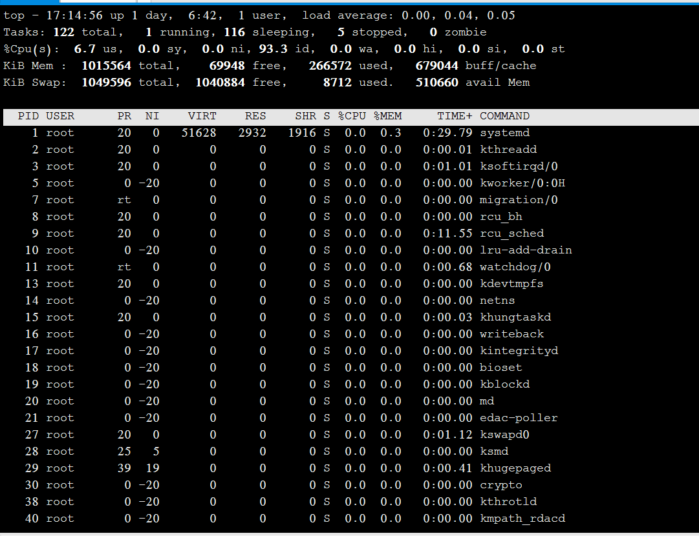

# [LINUX查看进程的4种方法](https://www.cnblogs.com/hml-blog-com/p/11558369.html)

进程是在 CPU 及内存中运行的程序代码，而每个进程可以创建一个或多个进程（父子进程）。

**查看进程方法：**

## **第一种：ps -aux**

```shell
ps -aux
```

ps命令用于报告当前系统的进程状态。可以搭配kill指令随时中断、删除不必要的程序。ps命令是最基本同时也是非常强大的进程查看命令，使用该命令可以确定有哪些进程正在运行和运行的状态、进程是否结束、进程有没有僵死、哪些进程占用了过多的资源等等，总之大部分信息都是可以通过执行该命令得到的。

a：显示当前终端下的所有进程信息，包括其他用户的进程。

u：使用以用户为主的格式输出进程信息。

x：显示当前用户在所有终端下的进程。

示例：

**上图中各字段解释：**

USER：启动该进程的用户账号名称
PID：该进程的ID号，在当前系统中是唯一的
%CPU：CPU占用的百分比
%MEM：内存占用的百分比

VSZ：占用虚拟内存（swap空间）的大小
RSS：占用常驻内存（物理内存）的大小

TTY：该进程在哪个终端上运行。“？”表未知或不需要终端
STAT：显示了进程当前的状态，如S（休眠）、R（运行）、Z（僵死）、<（高优先级）、N（低优先级）、s（父进程）、+（前台进程）。对处于僵死状态的进程应予以手动终止。

START：启动该进程的时间
TIME：该进程占用CPU时间
COMMAND：启动该进程的命令的名称

**总结：ps aux 是以简单列表的形式显示出进程信息。**

## **第二种：ps -elf**

```shell
ps -elf
```

-e：显示系统内的所有进程信息。

-l：使用长（long）格式显示进程信息。

-f：使用完整的（full）格式显示进程信息。

上图字段解释：
大部分跟第一种一样，PPID为父进程的PID。

## **第三种：top**

```shell
top
```


以全屏交互式的界面显示进程排名，及时跟踪包括CPU、内存等系统资源占用情况，默认情况下每三秒刷新一次，其作用基本类似于Windows系统中的任务管理器。



上图解释：
Tasks（系统任务）信息：total，总进程数；running，正在运行的进程数；sleeping，休眠的进程数；stopped，中止的进程数；zombie，僵死无响应的进程数。

CPU信息：us，用户占用；sy，内核占用；ni，优先级调度占用；id，空闲CPU；wa，I/O等待占用；hi，硬件中断占用；si，软件中断占用；st，虚拟化占用。了解空闲的CPU百分比，主要看%id部分。

Mem（内存）信息：total，总内存空间；used，已用内存；free，空闲内存；buffers，缓存区域。

Swap（交换空间）信息：total，总交换空间；used，已用交换空间；free，空闲交换空间；cached，缓存空间。

## **第四种：pstree -aup**

```shell
pstree -aup
```

以树状图的方式展现进程之间的派生关系，显示效果比较直观。
-a：显示每个程序的完整指令，包含路径，参数或是常驻服务的标示；
-c：不使用精简标示法；
-G：使用VT100终端机的列绘图字符；
-h：列出树状图时，特别标明现在执行的程序；
-H<程序识别码>：此参数的效果和指定"-h"参数类似，但特别标明指定的程序；
-l：采用长列格式显示树状图；
-n：用程序识别码排序。预设是以程序名称来排序；
-p：显示程序识别码；
-u：显示用户名称；
