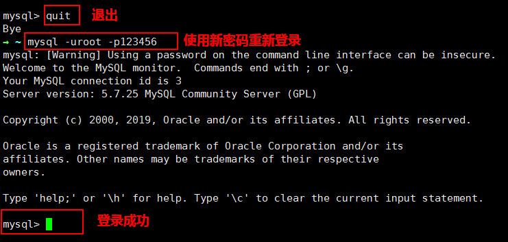
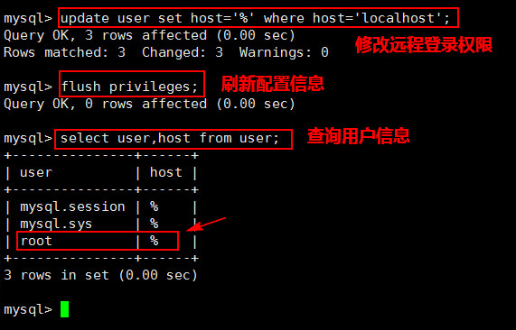
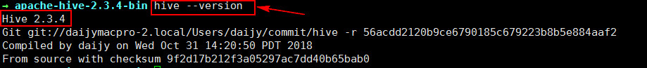
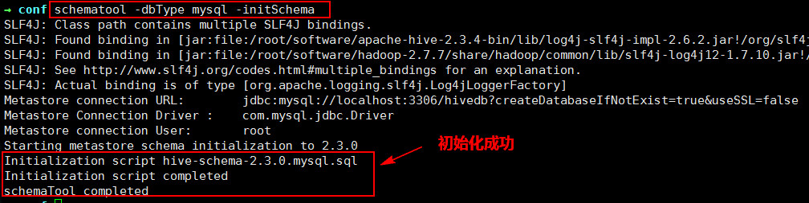
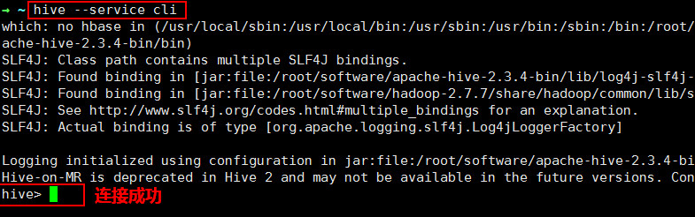

## 任务 1：安装 MySQL

### 1.1 解压安装包

　　现在已经为大家下载好了 MySQL 5.7.25 的安装包，存放在 /root/software 目录下，首先进入此目录下，使用如下命令进行解压即可使用：

```shell
tar -xvf mysql-5.7.25-1.el7.x86_64.rpm-bundle.tar
```

　　将其解压到当前目录下，即 /root/software 中。

### 1.2 安装 MySQL 组件

　　使用 `rpm -ivh` 命令依次安装以下组件：

```shell
rpm 不成功加入 --nodeps --force
列：rpm -ivh mysql-community-libs-5.7.25-1.el7.x86_64.rpm --nodeps --force
```

　　（1）首先安装 mysql-community-common （服务器和客户端库的公共文件），使用命令：

```shell
rpm -ivh mysql-community-common-5.7.25-1.el7.x86_64.rpm 
```

　　（2）其次安装 mysql-community-libs（MySQL 数据库客户端应用程序的共享库），使用命令：

```shell
rpm -ivh mysql-community-libs-5.7.25-1.el7.x86_64.rpm
```

　　（3）之后安装 mysql-community-libs-compat（MySQL 之前版本的共享兼容库），使用命令：

```shell
rpm -ivh mysql-community-libs-compat-5.7.25-1.el7.x86_64.rpm 
```

　　（4）之后安装 mysql-community-client（MySQL 客户端应用程序和工具），使用命令：

```shell
rpm -ivh mysql-community-client-5.7.25-1.el7.x86_64.rpm 
```

　　（5）最后安装 mysql-community-server（数据库服务器和相关工具），使用命令：

```shell
rpm -ivh mysql-community-server-5.7.25-1.el7.x86_64.rpm 
```

### 1.3 登录 MySQL

#### 1. 初始化 MySQL 的数据库

　　安装好 MySQL 后，我们需要初始化数据库，初始化和启动数据库时最好不要使用 root 用户，而是使用 MySQL 用户启动。

```shell
/usr/sbin/mysqld --initialize-insecure --user=mysql
```

#### 2. 启动 MySQL 服务

　　使用如下命令**开启 MySQL 服务**，让其在后台运行：

```shell
/usr/sbin/mysqld --user=mysql &
```

　　说明：一定要加“&”，才能脚本放到后台运行。

#### 3. 登录 MySQL

　　使用 root 用户**无密码登录 MySQL**：

```shell
mysql -uroot
```

#### 4. 重置 MySQL 密码

　　在 5.7 版本后，我们可以使用 `alter user...identified by`命令把 root 用户的密码修改为“123456”，具体命令如下所示：

```sql
mysql> alter user 'root'@'localhost' identified by '123456';
```

　　修改完成，使用`exit`或者`quit`命令退出 MySQL，重新登录验证密码是否修改成功，具体命令如下所示：

```sql
mysql -uroot -p123456
```

　　效果如下图所示：


### 1.4 增加远程登录权限

　　当我们的帐号不允许从远程登录，只能在 localhost 连接时。这个时候只要在 MySQL 服务器上，更改 MySQL 数据库里的 user 表里的 host 项，从 localhost 改成 % 即可实现用户远程登录。

#### （1）首先我们来查看 MySQL 数据库下的 user 表信息：

```sql
mysql> use mysql;  # 切换成mysql数据库
mysql> select user,host from user; # 查询用户信息
```

　　可以看到在 user 表中已创建的 root 用户。host 字段表示登录的主机，其值可以用 IP 地址，也可用主机名。

#### （2）实现远程连接（授权法）

　　将 host 字段的值改为 % 就表示在任何客户端机器上能以 root 用户登录到 MySQL 服务器，建议在开发时设为 %。

```sql
# 设置远程登录权限 
mysql> update user set host='%' where host='localhost';
# 刷新配置信息
mysql> flush privileges;
```

　效果图如下所示：


## 任务 2：Hive 安装部署

### 2.1 解压安装包

　　现在已经为大家下载好了 hive2.3.4 的安装包，存放在 /root/software 目录下，首先进入此目录下，使用如下命令进行解压即可使用：

```
tar -zxvf apache-hive-2.3.4-bin.tar.gz
```

　　将其**解压到当前目录下**，即 /root/software 中。

### 2.2 配置环境变量

#### （1）首先打开 /etc/profile 文件：

```
vim /etc/profile
```

#### （2）将以下内容添加到配置文件的底部，添加完成输入“:wq”保存退出：

```shell
# 配置Hive的安装目录   
export HIVE_HOME=/root/software/apache-hive-2.3.4-bin  
# 在原PATH的基础上加入Hive的bin目录  
export PATH=$PATH:$HIVE_HOME/bin
```

#### （3）让配置文件立即生效，使用如下命令：

```
source /etc/profile
```

#### （4）检测 Hive 环境变量是否设置成功，使用如下命令查看 Hive 版本：

```
hive --version
```

执行此命令后，若是出现 Hive 版本信息说明配置成功：


### 2.3 修改配置文件 hive-env.sh

　　切换到 ${HIVE_HOME}/conf 目录下，将 hive-env.sh.template 文件**复制一份并重命名**为 hive-env.sh：

```
cp hive-env.sh.template hive-env.sh
```

　　修改完成，使用 **vi 编辑器**进行编辑：

```
vim hive-env.sh
```

　　在文件中配置 **HADOOP_HOME**、**HIVE_CONF_DIR** 以及**HIVE_AUX_JARS_PATH** 参数：

```shell
# 配置Hadoop安装路径  
HADOOP_HOME=/root/software/hadoop-2.7.7  
  
# 配置Hive配置文件存放路径  
export HIVE_CONF_DIR=/root/software/apache-hive-2.3.4-bin/conf  
  
# 配置Hive运行资源库路径  
export HIVE_AUX_JARS_PATH=/root/software/apache-hive-2.3.4-bin/lib
```

　　配置完成，输入“:wq”保存退出。

## 任务 3：Hive 元数据配置到 MySQL

### 3.1 驱动拷贝

　　将/root/software 目录下的 MySQL 驱动包 mysql-connector-java-5.1.47-bin.jar 拷贝到 ${HIVE_HOME}/lib 目录下。cp

```
cd /root/software/  
cp mysql-connector-java-5.1.47-bin.jar apache-hive-2.3.4-bin/lib/
```

### 3.2 配置 Metastore 到 MySQL

　　（1）在 ${HIVE_HOME}/conf 目录下创建一个名为 hive-site.xml 的文件，并使用 vi 编辑器进行编辑：

```
touch hive-site.xml  
vim hive-site.xml
```

　　（2）根据官方文档配置参数（https://cwiki.apache.org/confluence/display/Hive/AdminManual+Metastore+Administration），拷贝数据到 hive-site.xml 文件中：

```xml
<configuration>  
    <!--连接元数据库的链接信息 -->    
    <property>  
        <name>javax.jdo.option.ConnectionURL</name>
        <value>jdbc:mysql://localhost:3306/hivedb?createDatabaseIfNotExist=true&amp;useSSL=false&amp;useUnicode=true&amp;characterEncoding=UTF-8</value> 
        <description>JDBC connect string for a JDBC metastore</description>  
    </property>  
    <property>  
        <!--连接数据库驱动 -->   
        <name>javax.jdo.option.ConnectionDriverName</name>  
        <value>com.mysql.jdbc.Driver</value>  
        <description>Driver class name for a JDBC metastore</description> 
    </property>  
    <!--连接数据库用户名称 -->    
    <property>  
        <name>javax.jdo.option.ConnectionUserName</name>  
        <value>root</value>  
        <description>username to use against metastore database</description>  
    </property>  
    <!--连接数据库用户密码 -->   
    <property>  
        <name>javax.jdo.option.ConnectionPassword</name>  
        <value>123456</value>  
        <description>password to use against metastore database</description>  
    </property>  
</configuration>
```

### 3.3 初始化元数据库

　　注意：**如果使用的是 2.x 版本的 Hive，那么就必须手动初始化元数据库。** 使用 `schematool -dbType <db type> -initSchema` 命令进行初始化：

```
schematool -dbType mysql -initSchema
```

　　若是出现“schemaTool completed”则初始化成功。


### 3.4 Hive 连接

　　在任意目录下使用 Hive 的三种连接方式之一：**CLI 启动 Hive**。由于已经在环境变量中配置了 HIVE_HOME ，所以这里直接在命令行执行如下命令即可：

```
hive  
或者  
hive --service cli
```

效果如下图所示：


可以使用如下命令退出 Hive 客户端：

```shell
hive> exit;
或者
hive> quit;
```

任务要求!

### Hive 本地模式安装，具体步骤如下：

#### 1. 安装 MySQL

**（1）解压安装包**
**（2）安装 MySQL 组件**，顺序为：
common——》libs——》libs-compat——》client——》server
**（3）登录 MySQL**

- 初始化 MySQL 的数据库
- 启动 MySQL 服务
- 登录 MySQL
- 重置 MySQL 密码

**（4）增加远程登录权限**

#### 2. Hive 安装部署

**（1）解压安装包**
**（2）配置环境变量：/etc/profile 文件**
**（3）修改配置文件 hive-env.sh**

#### 3. Hive 元数据配置到 MySQL

**（1）驱动拷贝**：　将 MySQL 驱动包 mysql-connector-java-5.1.47-bin.jar 拷贝到 ${HIVE_HOME}/lib 目录下。
**（2）配置 Metastore 到 MySQL**：hive-site.xml
**（3）初始化元数据库**
**（4）Hive 连接**


知识点!

（1）首先，将 `${HIVE_HOME}/conf` 目录下的 hive-log4j2.properties.template 文件复制一份并重命名为 hive-log4j2.properties，具体命令如下所示：

```shell
cp hive-log4j2.properties.template hive-log4j2.properties
```

（2）之后使用 vi 编辑器进行编辑，将 Hive 日志配置到 /root/hive/logs/myhive.log 文件中。用到的两个参数是：

- property.hive.log.dir
- property.hive.log.file

（3）重新启动 Hive：

```sh
hive
或者
hive --service cli
```

（4）验证新的日志文件是否自动创建：


从上图可以看出，我们成功将 Hive 日志存放路径修改为 /root/hive/logs/myhive.log。

任务要求

### Hive 运行日志信息配置

在 Hive 中，使用的是 Log4j 来输出日志，**默认情况下，CLI 是不能将日志信息输出到控制台的。**

默认的日志存放在`/tmp/${user.name}`文件夹的`hive.log`文件中，全路径就是`/tmp/${user.name}/hive.log`。

现要求将 Hive 的日志存放路径修改为 **/root/hive/logs**，日志文件为**myhive.log**。

