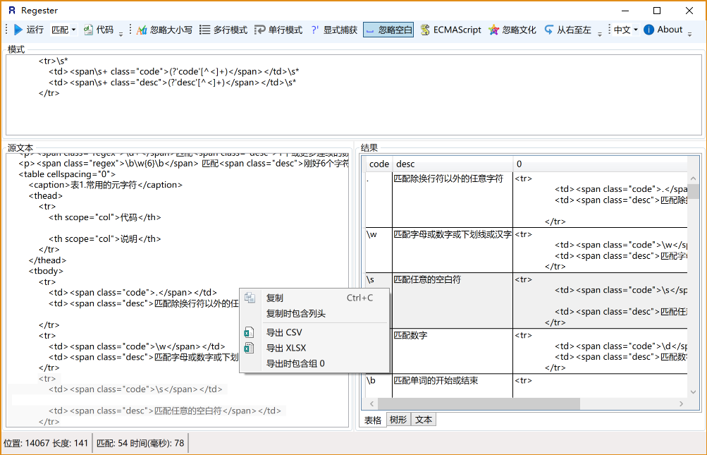

# 正则表达式30分钟入门教程

版本：v2.4.1 (2019-11-15) 作者：[deerchao](https://deerchao.cn/) 转载请注明[来源](https://deerchao.cn/tutorials/regex/regex.htm)

## 如何使用本教程

别被下面那些复杂的表达式吓倒，只要跟着我一步一步来，你会发现正则表达式其实并没有想像中的那么困难。当然，如果你看完了这篇教程之后，发现自己明白了很多，却又几乎什么都记不得，那也是很正常的——我认为，没接触过正则表达式的人在看完这篇教程后，能把提到过的语法记住80%以上的可能性为零。这里只是让你明白基本的原理，以后你还需要多练习，多使用，才能熟练掌握正则表达式。

除了作为入门教程之外，本文还试图成为可以在日常工作中使用的正则表达式语法参考手册。就作者本人的经历来说，这个目标还是完成得不错的——你看，我自己也没能把所有的东西记下来，不是吗？

[清除格式](https://deerchao.cn/tutorials/regex/regex.htm) 文本格式约定：**专业术语** 元字符/语法格式 正则表达式 正则表达式中的一部分(用于分析) *对其进行匹配的源字符串* 对正则表达式或其中一部分的说明

[隐藏边注](https://deerchao.cn/tutorials/regex/regex.htm) 本文右边有一些注释，主要是用来提供一些相关信息，或者给没有程序员背景的读者解释一些基本概念，通常可以忽略。

本文介绍的大部分正则语法，在不同的正则表达式引擎中都可以使用，但也有一些会有所差异。本文介绍的是 .Net 下的正则表达式，其它环境下的具体情况可以在读完本文后去参考官方文档，或者查看[正则表达式引擎特性对比](https://deerchao.cn/tutorials/regex/diffs.html)。

最重要的是——请给我*30分钟*，如果你没有使用正则表达式的经验，请不要试图在30*秒*内入门——除非你是超人 :)

## 正则表达式到底是什么东西？

在编写处理字符串的程序或网页时，经常会有查找符合某些复杂规则的字符串的需要。**正则表达式**就是用于描述这些规则的工具。换句话说，正则表达式就是记录文本规则的代码。

很可能你使用过Windows/Dos下用于文件查找的**通配符(wildcard)**，也就是*和?。如果你想查找某个目录下的所有的Word文档的话，你会搜索*.doc。在这里，*会被解释成任意的字符串。和通配符类似，正则表达式也是用来进行文本匹配的工具，只不过比起通配符，它能更精确地描述你的需求——当然，代价就是更复杂——比如你可以编写一个正则表达式，用来查找所有以0开头，后面跟着2-3个数字，然后是一个连字号“-”，最后是7或8位数字的字符串(像*010-12345678*或*0376-7654321*)。

**字符**是计算机软件处理文字时最基本的单位，可能是字母，数字，标点符号，空格，换行符，汉字等等。**字符串**是0个或更多个字符的序列。**文本**也就是文字，字符串。说某个字符串**匹配**某个正则表达式，通常是指这个字符串里有一部分（或几部分分别）能满足表达式给出的条件。

## 入门

学习正则表达式的最好方法是从例子开始，理解例子之后再自己对例子进行修改，实验。下面给出了不少简单的例子，并对它们作了详细的说明。

假设你在一篇英文小说里查找hi，你可以使用正则表达式hi。

这几乎是最简单的正则表达式了，它可以精确匹配这样的字符串：由两个字符组成，前一个字符是h,后一个是i。通常，处理正则表达式的工具会提供一个忽略大小写的选项，如果选中了这个选项，它可以匹配*hi*,*HI*,*Hi*,*hI*这四种情况中的任意一种。

不幸的是，很多单词里包含*hi*这两个连续的字符，比如*him*,*history*,*high*等等。用hi来查找的话，这里边的*hi*也会被找出来。如果要精确地查找hi这个单词的话，我们应该使用\bhi\b。

\b是正则表达式规定的一个特殊代码（好吧，某些人叫它**元字符，metacharacter**），代表着单词的开头或结尾，也就是单词的分界处。虽然通常英文的单词是由空格，标点符号或者换行来分隔的，但是\b并不匹配这些单词分隔字符中的任何一个，它**只匹配一个位置**。

如果需要更精确的说法，\b匹配这样的位置：它的前一个字符和后一个字符不全是(一个是,一个不是或不存在)\w。

假如你要找的是hi后面不远处跟着一个Lucy，你应该用\bhi\b.*\bLucy\b。

这里，.是另一个元字符，匹配除了换行符以外的任意字符。*同样是元字符，不过它代表的不是字符，也不是位置，而是数量——它指定*前边的内容可以连续重复使用任意次以使整个表达式得到匹配。因此，.*连在一起就意味着任意数量的不包含换行的字符。现在\bhi\b.*\bLucy\b的意思就很明显了：先是一个单词hi,然后是任意个任意字符(但不能是换行)，最后是Lucy这个单词。

换行符就是'\n',ASCII编码为10(十六进制0x0A)的字符。

如果同时使用其它元字符，我们就能构造出功能更强大的正则表达式。比如下面这个例子：

0\d\d-\d\d\d\d\d\d\d\d匹配这样的字符串：以0开头，然后是两个数字，然后是一个连字号“-”，最后是8个数字(也就是中国的电话号码。当然，这个例子只能匹配区号为3位的情形)。

这里的\d是个新的元字符，匹配一位数字(0，或1，或2，或……)。-不是元字符，只匹配它本身——连字符(或者减号，或者中横线，或者随你怎么称呼它)。

为了避免那么多烦人的重复，我们也可以这样写这个表达式：0\d{2}-\d{8}。这里\d后面的{2}({8})的意思是前面\d必须连续重复匹配2次(8次)。

## 测试正则表达式

如果你不觉得正则表达式很难读写的话，要么你是一个天才，要么，你不是地球人。正则表达式的语法很令人头疼，即使对经常使用它的人来说也是如此。由于难于读写，容易出错，所以找一种工具对正则表达式进行测试是很有必要的。

不同的环境下正则表达式的一些细节是不相同的，本教程介绍的是微软 .Net Framework 4.5 下正则表达式的行为，所以，我向你推荐我编写的.Net下的工具 [Regester](https://deerchao.cn/tools/regester/)。请参考该页面的说明来安装和运行该软件。

下面是Regester运行时的截图：

[](https://deerchao.cn/tools/regester/)

你也可以试试这个在线测试工具：[Wegester, JavaScript正则表达式测试器。](https://deerchao.cn/tools/wegester/)

## 元字符

现在你已经知道几个很有用的元字符了，如\b,.,*，还有\d.正则表达式里还有更多的元字符，比如\s匹配任意的空白符，包括空格，制表符(Tab)，换行符，中文全角空格等。\w匹配字母或数字或下划线或汉字等。

对中文/汉字的特殊处理是由.Net提供的正则表达式引擎支持的，其它环境下的具体情况请查看相关文档。

下面来看看更多的例子：

\ba\w*\b匹配以字母a开头的单词——先是某个单词开始处(\b)，然后是字母a,然后是任意数量的字母或数字(\w*)，最后是单词结束处(\b)。

\d+匹配1个或更多连续的数字。这里的+是和*类似的元字符，不同的是*匹配重复任意次(可能是0次)，而+则匹配重复1次或更多次。

\b\w{6}\b 匹配刚好6个字符的单词。

好吧，现在我们说说正则表达式里的单词是什么意思吧：就是不少于一个的连续的\w。不错，这与学习英文时要背的成千上万个同名的东西的确关系不大 :)

| 代码 | 说明                         |
| ---- | ---------------------------- |
| .    | 匹配除换行符以外的任意字符   |
| \w   | 匹配字母或数字或下划线或汉字 |
| \s   | 匹配任意的空白符             |
| \d   | 匹配数字                     |
| \b   | 匹配单词的开始或结束         |
| ^    | 匹配字符串的开始             |
| $    | 匹配字符串的结束             |

元字符^（和数字6在同一个键位上的符号）和$都匹配一个位置，这和\b有点类似。^匹配你要用来查找的字符串的开头，$匹配结尾。这两个代码在验证输入的内容时非常有用，比如一个网站如果要求你填写的QQ号必须为5位到12位数字时，可以使用：^\d{5,12}$。

这里的{5,12}和前面介绍过的{2}是类似的，只不过{2}匹配只能不多不少重复2次，{5,12}则是重复的次数不能少于5次，不能多于12次，否则都不匹配。

因为使用了^和$，所以输入的整个字符串都要用来和\d{5,12}来匹配，也就是说整个输入必须是5到12个数字，因此如果输入的QQ号能匹配这个正则表达式的话，那就符合要求了。

和忽略大小写的选项类似，有些正则表达式处理工具还有一个处理多行的选项。如果选中了这个选项，^和$的意义就变成了匹配行的开始处和结束处。

正则表达式引擎通常会提供一个“测试指定的字符串是否匹配一个正则表达式”的方法，如JavaScript里的RegExp.test()方法或.NET里的Regex.IsMatch()方法。这里的匹配是指是字符串里有没有符合表达式规则的部分。如果不使用^和$的话，对于\d{5,12}而言，使用这样的方法就只能保证字符串里包含5到12连续位数字，而不是整个字符串就是5到12位数字。

## 字符转义

如果你想查找元字符本身的话，比如你查找.,或者*,就出现了问题：你没办法指定它们，因为它们会被解释成别的意思。这时你就得使用\来取消这些字符的特殊意义。因此，你应该使用\.和\*。当然，要查找\本身，你也得用\\.

例如：deerchao\.cn匹配deerchao.cn，C:\\Windows匹配C:\Windows。

## 重复

你已经看过了前面的*,+,{2},{5,12}这几个匹配重复的方式了。下面是正则表达式中所有的限定符(指定数量的代码，例如*,{5,12}等)：

| 代码/语法 | 说明             |
| --------- | ---------------- |
| *         | 重复零次或更多次 |
| +         | 重复一次或更多次 |
| ?         | 重复零次或一次   |
| {n}       | 重复n次          |
| {n,}      | 重复n次或更多次  |
| {n,m}     | 重复n到m次       |

下面是一些使用重复的例子：

Windows\d+匹配Windows后面跟1个或更多数字

^\w+匹配一行的第一个单词(或整个字符串的第一个单词，具体匹配哪个意思得看选项设置)

## 字符类

要想查找数字，字母或数字，空白是很简单的，因为已经有了对应这些字符集合的元字符，但是如果你想匹配没有预定义元字符的字符集合(比如元音字母a,e,i,o,u),应该怎么办？

很简单，你只需要在方括号里列出它们就行了，像[aeiou]就匹配任何一个英文元音字母，[.?!]匹配标点符号(.或?或!)。

我们也可以轻松地指定一个字符**范围**，像[0-9]代表的含意与\d就是完全一致的：一位数字；同理[a-z0-9A-Z_]也完全等同于\w（如果只考虑英文的话）。

下面是一个更复杂的表达式：\(?0\d{2}[) -]?\d{8}。

这个表达式可以匹配几种格式的电话号码，像*(010)88886666*，或*022-22334455*，或*02912345678*等。我们对它进行一些分析吧：首先是一个转义字符\(,它能出现0次或1次(?),然后是一个0，后面跟着2个数字(\d{2})，然后是)或-或空格中的一个，它出现1次或不出现(?)，最后是8个数字(\d{8})。

“(”和“)”也是元字符，后面的[分组节](https://deerchao.cn/tutorials/regex/regex.htm#grouping)里会提到，所以在这里需要使用[转义](https://deerchao.cn/tutorials/regex/regex.htm#escape)。

## 分枝条件

不幸的是，刚才那个表达式也能匹配*010)12345678*或*(022-87654321*这样的“不正确”的格式。要解决这个问题，我们需要用到**分枝条件**。正则表达式里的**分枝条件**指的是有几种规则，如果满足其中任意一种规则都应该当成匹配，具体方法是用|把不同的规则分隔开。听不明白？没关系，看例子：

0\d{2}-\d{8}|0\d{3}-\d{7}这个表达式能匹配两种以连字号分隔的电话号码：一种是三位区号，8位本地号(如010-12345678)，一种是4位区号，7位本地号(0376-2233445)。

\(0\d{2}\)[- ]?\d{8}|0\d{2}[- ]?\d{8}这个表达式匹配3位区号的电话号码，其中区号可以用小括号括起来，也可以不用，区号与本地号间可以用连字号或空格间隔，也可以没有间隔。你可以试试用分枝条件把这个表达式扩展成也支持4位区号的。

\d{5}-\d{4}|\d{5}这个表达式用于匹配美国的邮政编码。美国邮编的规则是5位数字，或者用连字号间隔的9位数字。之所以要给出这个例子是因为它能说明一个问题：**使用分枝条件时，要注意各个条件的顺序**。如果你把它改成\d{5}|\d{5}-\d{4}的话，那么就只会匹配5位的邮编(以及9位邮编的前5位)。原因是匹配分枝条件时，将会从左到右地测试每个条件，如果满足了某个分枝的话，就不会去再管其它的条件了。

## 分组

我们已经提到了怎么重复单个字符（直接在字符后面加上限定符就行了）；但如果想要重复多个字符又该怎么办？你可以用小括号来指定**子表达式**(也叫做**分组**)，然后你就可以指定这个子表达式的重复次数了，你也可以对子表达式进行其它一些操作(后面会有介绍)。

(\d{1,3}\.){3}\d{1,3}是一个简单的IP地址匹配表达式。要理解这个表达式，请按下列顺序分析它：\d{1,3}匹配1到3位的数字，(\d{1,3}\.){3}匹配三位数字加上一个英文句号(这个整体也就是这个**分组**)重复3次，最后再加上一个一到三位的数字(\d{1,3})。

不幸的是，它也将匹配*256.300.888.999*这种不可能存在的IP地址。如果能使用算术比较的话，或许能简单地解决这个问题，但是正则表达式中并不提供关于数学的任何功能，所以只能使用冗长的分组，选择，字符类来描述一个正确的IP地址：((2[0-4]\d|25[0-5]|[01]?\d\d?)\.){3}(2[0-4]\d|25[0-5]|[01]?\d\d?)。

理解这个表达式的关键是理解2[0-4]\d|25[0-5]|[01]?\d\d?，这里我就不细说了，你自己应该能分析得出来它的意义。

IP地址中每个数字都不能大于255. 经常有人问我, 01.02.03.04 这样前面带有0的数字, 是不是正确的IP地址呢? 答案是: 是的, IP 地址里的数字可以包含有前导 0 (leading zeroes).

## 反义

有时需要查找不属于某个能简单定义的字符类的字符。比如想查找除了数字以外，其它任意字符都行的情况，这时需要用到**反义**：

| 代码/语法 | 说明                                       |
| --------- | ------------------------------------------ |
| \W        | 匹配任意不是字母，数字，下划线，汉字的字符 |
| \S        | 匹配任意不是空白符的字符                   |
| \D        | 匹配任意非数字的字符                       |
| \B        | 匹配不是单词开头或结束的位置               |
| [^x]      | 匹配除了x以外的任意字符                    |
| [^aeiou]  | 匹配除了aeiou这几个字母以外的任意字符      |

例子：\S+匹配不包含空白符的字符串。

<a[^>]+>匹配用尖括号括起来的以a开头的字符串。

## 后向引用

使用小括号指定一个子表达式后，**匹配这个子表达式的文本**(也就是此分组捕获的内容)可以在表达式或其它程序中作进一步的处理。默认情况下，每个分组会自动拥有一个**组号**，规则是：从左向右，以分组的左括号为标志，第一个出现的分组的组号为1，第二个为2，以此类推。

呃……其实,组号分配还不像我刚说得那么简单：

- 分组0对应整个正则表达式
- 实际上组号分配过程是要从左向右扫描两遍的：第一遍只给未命名组分配，第二遍只给命名组分配－－因此所有命名组的组号都大于未命名的组号
- 你可以使用(?:exp)这样的语法来剥夺一个分组对组号分配的参与权．

**后向引用**用于重复搜索前面某个分组匹配的文本。例如，\1代表分组1匹配的文本。难以理解？请看示例：

\b(\w+)\b\s+\1\b可以用来匹配重复的单词，像*go go*, 或者*kitty kitty*。这个表达式首先是一个单词，也就是单词开始处和结束处之间的多于一个的字母或数字(\b(\w+)\b)，这个单词会被捕获到编号为1的分组中，然后是1个或几个空白符(\s+)，最后是分组1中捕获的内容（也就是前面匹配的那个单词）(\1)。

你也可以自己指定子表达式的**组名**。要指定一个子表达式的组名，请使用这样的语法：(?<Word>\w+)(或者把尖括号换成'也行：(?'Word'\w+)),这样就把\w+的组名指定为Word了。要反向引用这个分组**捕获**的内容，你可以使用\k<Word>,所以上一个例子也可以写成这样：\b(?<Word>\w+)\b\s+\k<Word>\b。

使用小括号的时候，还有很多特定用途的语法。下面列出了最常用的一些：

| 分类         | 代码/语法                                                    | 说明                                                         |
| ------------ | ------------------------------------------------------------ | ------------------------------------------------------------ |
| 捕获         | (exp)                                                        | 匹配exp,并捕获文本到自动命名的组里                           |
| (?<name>exp) | 匹配exp,并捕获文本到名称为name的组里，也可以写成(?'name'exp) |                                                              |
| (?:exp)      | 匹配exp,不捕获匹配的文本，也不给此分组分配组号               |                                                              |
| 零宽断言     | (?=exp)                                                      | 匹配exp前面的位置                                            |
| s(?<=exp)    | 匹配exp后面的位置                                            |                                                              |
| (?!exp)      | 匹配后面跟的不是exp的位置                                    |                                                              |
| (?<!exp)     | 匹配前面不是exp的位置                                        |                                                              |
| 注释         | (?#comment)                                                  | 这种类型的分组不对正则表达式的处理产生任何影响，用于提供注释让人阅读 |

我们已经讨论了前两种语法。第三个(?:exp)不会改变正则表达式的处理方式，只是这样的组匹配的内容不会像前两种那样被捕获到某个组里面，也不会拥有组号。“我为什么会想要这样做？”——好问题，你觉得为什么呢？

## 零宽断言

接下来的四个用于查找在某些内容(但并不包括这些内容)之前或之后的东西，也就是说它们像\b,^,$那样用于指定一个位置，这个位置应该满足一定的条件(即断言)，因此它们也被称为**零宽断言**。最好还是拿例子来说明吧：

断言用来声明一个应该为真的事实。正则表达式中只有当断言为真时才会继续进行匹配。

(?=exp)也叫**零宽度正预测先行断言**，它断言自身出现的位置的后面能匹配表达式exp。比如\b\w+(?=ing\b)，匹配以ing结尾的单词的前面部分(除了ing以外的部分)，如查找*I'm singing while you're dancing.*时，它会匹配sing和danc。

(?<=exp)也叫**零宽度正回顾后发断言**，它断言自身出现的位置的前面能匹配表达式exp。比如(?<=\bre)\w+\b会匹配以re开头的单词的后半部分(除了re以外的部分)，例如在查找*reading a book*时，它匹配ading。

假如你想要给一个很长的数字中每三位间加一个逗号(当然是从右边加起了)，你可以这样查找需要在前面和里面添加逗号的部分：((?<=\d)\d{3})+\b，用它对*1234567890*进行查找时结果是234567890。

下面这个例子同时使用了这两种断言：(?<=\s)\d+(?=\s)匹配以空白符间隔的数字(再次强调，不包括这些空白符)。

## 负向零宽断言

前面我们提到过怎么查找**不是某个字符或不在某个字符类里**的字符的方法(反义)。但是如果我们只是想要**确保某个字符没有出现，但并不想去匹配它**时怎么办？例如，如果我们想查找这样的单词--它里面出现了字母q,但是q后面跟的不是字母u,我们可以尝试这样：

\b\w*q[^u]\w*\b匹配包含**后面不是字母u的字母q**的单词。但是如果多做测试(或者你思维足够敏锐，直接就观察出来了)，你会发现，如果q出现在单词的结尾的话，像**Iraq**,**Benq**，这个表达式就会出错。这是因为[^u]总要匹配一个字符，所以如果q是单词的最后一个字符的话，后面的[^u]将会匹配q后面的单词分隔符(可能是空格，或者是句号或其它的什么)，后面的\w*\b将会匹配下一个单词，于是\b\w*q[^u]\w*\b就能匹配整个*Iraq fighting*。**负向零宽断言**能解决这样的问题，因为它只匹配一个位置，并不**消费**任何字符。现在，我们可以这样来解决这个问题：\b\w*q(?!u)\w*\b。

**零宽度负预测先行断言**(?!exp)，断言此位置的后面不能匹配表达式exp。例如：\d{3}(?!\d)匹配三位数字，而且这三位数字的后面不能是数字；\b((?!abc)\w)+\b匹配不包含连续字符串abc的单词。

同理，我们可以用(?<!exp),**零宽度负回顾后发断言**来断言此位置的前面不能匹配表达式exp：(?<![a-z])\d{7}匹配前面不是小写字母的七位数字。

一个更复杂的例子：(?<=<(\w+)>).*(?=<\/\1>)匹配不包含属性的简单HTML标签内里的内容。(?<=<(\w+)>)指定了这样的**前缀**：被尖括号括起来的单词(比如可能是<b>)，然后是.*(任意的字符串),最后是一个**后缀**(?=<\/\1>)。注意后缀里的\/，它用到了前面提过的字符转义；\1则是一个反向引用，引用的正是捕获的第一组，前面的(\w+)匹配的内容，这样如果前缀实际上是<b>的话，后缀就是</b>了。整个表达式匹配的是<b>和</b>之间的内容(再次提醒，不包括前缀和后缀本身)。

## 注释

小括号的另一种用途是通过语法(?#comment)来包含注释。例如：2[0-4]\d(?#200-249)|25[0-5](?#250-255)|[01]?\d\d?(?#0-199)。

要包含注释的话，最好是启用“忽略模式里的空白符”选项，这样在编写表达式时能任意的添加空格，Tab，换行，而实际使用时这些都将被忽略。启用这个选项后，在#后面到这一行结束的所有文本都将被当成注释忽略掉。例如，我们可以前面的一个表达式写成这样：

```
      (?<=    # 断言要匹配的文本的前缀
      <(\w+)> # 查找尖括号括起来的内容
              # (即HTML/XML标签)
      )       # 前缀结束
      .*      # 匹配任意文本
      (?=     # 断言要匹配的文本的后缀
      <\/\1>  # 查找尖括号括起来的内容
              # 查找尖括号括起来的内容
      )       # 后缀结束
```

## 贪婪与懒惰

当正则表达式中包含能接受重复的限定符时，通常的行为是（在使整个表达式能得到匹配的前提下）匹配**尽可能多**的字符。以这个表达式为例：a.*b，它将会匹配最长的以a开始，以b结束的字符串。如果用它来搜索*aabab*的话，它会匹配整个字符串aabab。这被称为**贪婪**匹配。

有时，我们更需要**懒惰**匹配，也就是匹配**尽可能少**的字符。前面给出的限定符都可以被转化为懒惰匹配模式，只要在它后面加上一个问号?。这样.*?就意味着匹配任意数量的重复，但是在能使整个匹配成功的前提下使用最少的重复。现在看看懒惰版的例子吧：

a.*?b匹配最短的，以a开始，以b结束的字符串。如果把它应用于*aabab*的话，它会匹配aab（第一到第三个字符）和ab（第四到第五个字符）。

为什么第一个匹配是aab（第一到第三个字符）而不是ab（第二到第三个字符）？简单地说，因为正则表达式有另一条规则，比懒惰／贪婪规则的优先级更高：最先开始的匹配拥有最高的优先权——The match that begins earliest wins。

| 代码/语法 | 说明                            |
| --------- | ------------------------------- |
| *?        | 重复任意次，但尽可能少重复      |
| +?        | 重复1次或更多次，但尽可能少重复 |
| ??        | 重复0次或1次，但尽可能少重复    |
| {n,m}?    | 重复n到m次，但尽可能少重复      |
| {n,}?     | 重复n次以上，但尽可能少重复     |

## 处理选项

上面介绍了几个选项如忽略大小写，处理多行等，这些选项能用来改变处理正则表达式的方式。下面是.Net中常用的正则表达式选项：

| 名称                              | 说明                                                         |
| --------------------------------- | ------------------------------------------------------------ |
| IgnoreCase(忽略大小写)            | 匹配时不区分大小写。                                         |
| Multiline(多行模式)               | 更改^和$的含义，使它们分别在任意一行的行首和行尾匹配，而不仅仅在整个字符串的开头和结尾匹配。(在此模式下,$的精确含意是:匹配\n之前的位置以及字符串结束前的位置.) |
| Singleline(单行模式)              | 更改.的含义，使它与每一个字符匹配（包括换行符\n）。          |
| IgnorePatternWhitespace(忽略空白) | 忽略表达式中的非转义空白并启用由#标记的注释。                |
| ExplicitCapture(显式捕获)         | 仅捕获已被显式命名的组。                                     |

在C#中，你可以使用[Regex(String, RegexOptions)构造函数](http://msdn2.microsoft.com/zh-cn/library/h5845fdz.aspx)来设置正则表达式的处理选项。如：Regex regex = new Regex(@"\ba\w{6}\b", RegexOptions.IgnoreCase);

一个经常被问到的问题是：是不是只能同时使用多行模式和单行模式中的一种？答案是：不是。这两个选项之间没有任何关系，除了它们的名字比较相似（以至于让人感到疑惑）以外。事实上，为了避免混淆，在最新的 JavaScript 中，单行模式其实名叫 dotAll，意为点可以匹配所有字符，然而在指定该选项时，用的还是 Singleline 的首字母 s.

目前（2019/06），只有基于 Webkit/Chromium 的浏览器（如 Chrome, Safari等）才支持 dotAll 选项。

## 平衡组/递归匹配

有时我们需要匹配像( 100 * ( 50 + 15 ) )这样的可嵌套的层次性结构，这时简单地使用\(.+\)则只会匹配到最左边的左括号和最右边的右括号之间的内容(这里我们讨论的是贪婪模式，懒惰模式也有下面的问题)。假如原来的字符串里的左括号和右括号出现的次数不相等，比如*( 5 / ( 3 + 2 ) ) )*，那我们的匹配结果里两者的个数也不会相等。有没有办法在这样的字符串里匹配到最长的，配对的括号之间的内容呢？

这里介绍的平衡组语法是由.Net Framework支持的；其它语言／库不一定支持这种功能，或者支持此功能但需要使用不同的语法。

为了避免(和\(把你的大脑彻底搞糊涂，我们还是用尖括号代替圆括号吧。现在我们的问题变成了如何把*xx <aa <bbb> <bbb> aa> yy*这样的字符串里，最长的配对的尖括号内的内容捕获出来？

这里需要用到以下的语法构造：

- (?'group') 把捕获的内容命名为group,并压入**堆栈(Stack)**
- (?'-group') 从堆栈上弹出最后压入堆栈的名为group的捕获内容，如果堆栈本来为空，则本分组的匹配失败
- (?(group)yes|no) 如果堆栈上存在以名为group的捕获内容的话，继续匹配yes部分的表达式，否则继续匹配no部分
- (?!) 零宽负向先行断言，由于没有后缀表达式，试图匹配总是失败

我们需要做的是每碰到了左括号，就在压入一个"Open",每碰到一个右括号，就弹出一个，到了最后就看看堆栈是否为空－－如果不为空那就证明左括号比右括号多，那匹配就应该失败。正则表达式引擎会进行回溯(放弃最前面或最后面的一些字符)，尽量使整个表达式得到匹配。

```
<                   #最外层的左括号
  [^<>]*            #它后面非括号的内容
  (
      (
        (?'Open'<)  #左括号，压入"Open"
        [^<>]*      #左括号后面的内容
      )+
      (
        (?'-Open'>) #右括号，弹出一个"Open"
        [^<>]*      #右括号后面的内容
      )+
  )*
  (?(Open)(?!))     #最外层的右括号前检查
                    #若还有未弹出的"Open"
                    #则匹配失败

>                #最外层的右括号
```

平衡组的一个最常见的应用就是匹配HTML,下面这个例子可以匹配嵌套的<div>标签：<div[^>]*>[^<>]*(((?'Open'<div[^>]*>)[^<>]*)+((?'-Open'</div>)[^<>]*)+)*(?(Open)(?!))</div>.

如果你不是一个程序员（或者你自称程序员但是不知道堆栈是什么东西），你就这样理解上面的三种语法吧：第一个就是在黑板上写一个"group"，第二个就是从黑板上擦掉一个"group"，第三个就是看黑板上写的还有没有"group"，如果有就继续匹配yes部分，否则就匹配no部分。

## 还有些什么东西没提到

上边已经描述了构造正则表达式的大量元素，但是还有很多没有提到的东西。下面是一些未提到的元素的列表，包含语法和简单的说明。你可以在网上找到更详细的参考资料来学习它们--当你需要用到它们的时候。如果你安装了MSDN Library,你也可以在里面找到.Net下正则表达式详细的文档。这里的介绍很简略，如果你需要更详细的信息，而又没有在电脑上安装MSDN Library,可以查看[关于正则表达式语言元素的MSDN在线文档](http://msdn.microsoft.com/zh-cn/library/az24scfc.aspx)。

| 代码/语法        | 说明                                                         |
| ---------------- | ------------------------------------------------------------ |
| \a               | 报警字符(打印它的效果是电脑嘀一声)                           |
| \b               | 通常是单词分界位置，但如果在字符类里使用代表退格             |
| \t               | 制表符，Tab                                                  |
| \r               | 回车                                                         |
| \v               | 竖向制表符                                                   |
| \f               | 换页符                                                       |
| \n               | 换行符                                                       |
| \e               | Escape                                                       |
| \0nn             | ASCII代码中八进制代码为nn的字符                              |
| \xnn             | ASCII代码中十六进制代码为nn的字符                            |
| \unnnn           | Unicode代码中十六进制代码为nnnn的字符                        |
| \cN              | ASCII控制字符。比如\cC代表Ctrl+C                             |
| \A               | 字符串开头(类似^，但不受处理多行选项的影响)                  |
| \Z               | 字符串结尾或行尾(不受处理多行选项的影响)                     |
| \z               | 字符串结尾(类似$，但不受处理多行选项的影响)                  |
| \G               | 当前搜索的开头                                               |
| \p{name}         | Unicode中命名为name的字符类，例如\p{IsGreek}                 |
| (?>exp)          | 贪婪子表达式                                                 |
| (?<x>-<y>exp)    | 平衡组                                                       |
| (?im-nsx:exp)    | 在子表达式exp中改变处理选项                                  |
| (?im-nsx)        | 为表达式后面的部分改变处理选项                               |
| (?(exp)yes\|no)  | 把exp当作零宽正向先行断言，如果在这个位置能匹配，使用yes作为此组的表达式；否则使用no |
| (?(exp)yes)      | 同上，只是使用空表达式作为no                                 |
| (?(name)yes\|no) | 如果命名为name的组捕获到了内容，使用yes作为表达式；否则使用no |
| (?(name)yes)     | 同上，只是使用空表达式作为no                                 |

## 联系作者

好吧，我承认，我骗了你，读到这里你肯定花了不止30分钟。相信我，这是我的错，而不是因为你太笨。我之所以说"30分钟"，是为了让你有信心，有耐心继续下去。既然你看到了这里，那证明我的阴谋成功了。被忽悠的感觉很爽吧？

要投诉我，或者觉得我其实可以忽悠得更高明，或者有关于正则表达式的问题, 可以发邮件到 deerchao#qq#com。如果本文给了你帮助，你可以使用支付宝或微信支付向我打赏。点击本页右上方的“打赏”即可看到支付二维码，可能你得先[回到页面最顶端](https://deerchao.cn/tutorials/regex/regex.htm#top)。

## 网上的资源及本文参考文献

- [精通正则表达式(第3版)](https://u.jd.com/0yfKdc)
- [微软的正则表达式教程](https://docs.microsoft.com/zh-cn/dotnet/standard/base-types/regular-expressions)
- [Regex类(微软文档)](https://docs.microsoft.com/zh-cn/dotnet/api/system.text.regularexpressions.regex)
- [专业的正则表达式教学网站(英文)](http://www.regular-expressions.info/)
- [关于.Net下的平衡组的详细讨论（英文）](http://weblogs.asp.net/whaggard/archive/2005/02/20/377025.aspx)


## 正则表达式引擎/风味特性对比表

|                                                              |            |            |               |              |                     |         |              |           |         |           |           |         |         |       |       |
| ------------------------------------------------------------ | ---------- | ---------- | ------------- | ------------ | ------------------- | ------- | ------------ | --------- | ------- | --------- | --------- | ------- | ------- | ----- | ----- |
| 特性                                                         | JGsoft     | .NET       | Java          | Perl         | PCRE                | JS      | Python       | Ruby      | Tcl ARE | POSIX BRE | POSIX ERE | GNU BRE | GNU ERE | XML   | XPath |
| `\` 转义单个元字符                                           | YES        | YES        | YES           | YES          | YES                 | YES     | YES          | YES       | YES     | YES       | YES       | YES     | YES     | YES   | YES   |
| `\Q...\E` 转义多个元字符                                     | YES        | no         | Java 6        | YES          | YES                 | no      | no           | no        | no      | no        | no        | no      | no      | no    | no    |
| `\x00` ~ `\xFF` (ASCII 字符)                                 | YES        | YES        | YES           | YES          | YES                 | YES     | YES          | YES       | YES     | no        | no        | no      | no      | no    | no    |
| `\n` (换行), `\r` (回车), \t (制表)                          | YES        | YES        | YES           | YES          | YES                 | YES     | YES          | YES       | YES     | no        | no        | no      | no      | YES   | YES   |
| `\f` (换页), `\v` (竖直制表)                                 | YES        | YES        | YES           | YES          | YES                 | YES     | YES          | YES       | YES     | no        | no        | no      | no      | no    | no    |
| `\a` (响铃)                                                  | YES        | YES        | YES           | YES          | YES                 | no      | YES          | YES       | YES     | no        | no        | no      | no      | no    | no    |
| `\e` (转义)                                                  | YES        | YES        | YES           | YES          | YES                 | no      | no           | YES       | YES     | no        | no        | no      | no      | no    | no    |
| `\b` (退格), `\B` (反斜杠, `\`)                              | no         | no         | no            | no           | no                  | no      | no           | no        | YES     | no        | no        | no      | no      | no    | no    |
| `\cA` ~ `\cZ` (控制字符)                                     | YES        | YES        | YES           | YES          | YES                 | YES     | no           | no        | YES     | no        | no        | no      | no      | no    | no    |
| `\ca` ~ `\cz` (控制字符)                                     | YES        | YES        | no            | YES          | YES                 | YES     | no           | no        | YES     | no        | no        | no      | no      | no    | no    |
| 字符类/字符集 `[abc]`                                        |            |            |               |              |                     |         |              |           |         |           |           |         |         |       |       |
| 特性                                                         | JGsoft     | .NET       | Java          | Perl         | PCRE                | JS      | Python       | Ruby      | Tcl ARE | POSIX BRE | POSIX ERE | GNU BRE | GNU ERE | XML   | XPath |
| `[abc]` 字符类                                               | YES        | YES        | YES           | YES          | YES                 | YES     | YES          | YES       | YES     | YES       | YES       | YES     | YES     | YES   | YES   |
| `[^abc]` 反义字符类                                          | YES        | YES        | YES           | YES          | YES                 | YES     | YES          | YES       | YES     | YES       | YES       | YES     | YES     | YES   | YES   |
| `[a-z]` 字符类范围                                           | YES        | YES        | YES           | YES          | YES                 | YES     | YES          | YES       | YES     | YES       | YES       | YES     | YES     | YES   | YES   |
| `[\d-z]` 中的 `-` 视为字面量                                 | YES        | YES        | YES           | YES          | YES                 | no      | no           | no        | no      | no        | no        | no      | no      | no    | no    |
| `[a-\d]` 中的 `-` 视为字面量                                 | YES        | no         | no            | no           | YES                 | no      | no           | no        | no      | no        | no        | no      | no      | no    | no    |
| `\` 转义单个字符类元字符                                     | YES        | YES        | YES           | YES          | YES                 | YES     | YES          | YES       | YES     | no        | no        | no      | no      | YES   | YES   |
| `\Q...\E` 转义多个字符类元字符                               | YES        | no         | Java 6        | YES          | YES                 | no      | no           | no        | no      | no        | no        | no      | no      | no    | no    |
| `\d` 代表数字                                                | YES        | YES        | ascii         | YES          | ascii               | ascii   | option       | ascii     | YES     | no        | no        | no      | no      | YES   | YES   |
| `\w` 代表单词字符                                            | YES        | YES        | ascii         | YES          | ascii               | ascii   | option       | ascii     | YES     | no        | no        | YES     | YES     | YES   | YES   |
| `\s` 代表空白字符                                            | YES        | YES        | ascii         | YES          | ascii               | YES     | option       | ascii     | YES     | no        | no        | YES     | YES     | ascii | ascii |
| `\D`, `\W` and \S 代表反义字符类                             | YES        | YES        | YES           | YES          | YES                 | YES     | YES          | YES       | YES     | no        | no        | YES     | YES     | YES   | YES   |
| `[\b]` 匹配反斜杠(`\`)                                       | YES        | YES        | YES           | YES          | YES                 | YES     | YES          | YES       | YES     | no        | no        | no      | no      | no    | no    |
| 点                                                           |            |            |               |              |                     |         |              |           |         |           |           |         |         |       |       |
| 特性                                                         | JGsoft     | .NET       | Java          | Perl         | PCRE                | JS      | Python       | Ruby      | Tcl ARE | POSIX BRE | POSIX ERE | GNU BRE | GNU ERE | XML   | XPath |
| `.` 匹配换行符(`\n`)外所有字符                               | YES        | YES        | YES           | YES          | YES                 | YES     | YES          | YES       | YES     | YES       | YES       | YES     | YES     | YES   | YES   |
| 锚点                                                         |            |            |               |              |                     |         |              |           |         |           |           |         |         |       |       |
| 特性                                                         | JGsoft     | .NET       | Java          | Perl         | PCRE                | JS      | Python       | Ruby      | Tcl ARE | POSIX BRE | POSIX ERE | GNU BRE | GNU ERE | XML   | XPath |
| `^` 字符串/行开始                                            | YES        | YES        | YES           | YES          | YES                 | YES     | YES          | YES       | YES     | YES       | YES       | YES     | YES     | no    | YES   |
| `$` 字符串/行结束                                            | YES        | YES        | YES           | YES          | YES                 | YES     | YES          | YES       | YES     | YES       | YES       | YES     | YES     | no    | YES   |
| `\A` 字符串开始                                              | YES        | YES        | YES           | YES          | YES                 | no      | YES          | YES       | YES     | no        | no        | no      | no      | no    | no    |
| `\Z` 字符串结束，最后一个\n前                                | YES        | YES        | YES           | YES          | YES                 | no      | no           | YES       | YES     | no        | no        | no      | no      | no    | no    |
| `\z` 字符串结束                                              | YES        | YES        | YES           | YES          | YES                 | no      | `\Z`         | YES       | no      | no        | no        | no      | no      | no    | no    |
| `\`` 字符串开始                                              | no         | no         | no            | no           | no                  | no      | no           | no        | no      | no        | no        | YES     | YES     | no    | no    |
| `\'` 字符串结束                                              | no         | no         | no            | no           | no                  | no      | no           | no        | no      | no        | no        | YES     | YES     | no    | no    |
| 单词边界                                                     |            |            |               |              |                     |         |              |           |         |           |           |         |         |       |       |
| 特性                                                         | JGsoft     | .NET       | Java          | Perl         | PCRE                | JS      | Python       | Ruby      | Tcl ARE | POSIX BRE | POSIX ERE | GNU BRE | GNU ERE | XML   | XPath |
| `\b` 单词的开始或结束处                                      | YES        | YES        | YES           | YES          | ascii               | ascii   | option       | ascii     | no      | no        | no        | YES     | YES     | no    | no    |
| `\B` 不是单词的开始处或结束处                                | YES        | YES        | YES           | YES          | ascii               | ascii   | option       | ascii     | no      | no        | no        | YES     | YES     | no    | no    |
| `\y` 单词的开始或结束处                                      | YES        | no         | no            | no           | no                  | no      | no           | no        | YES     | no        | no        | no      | no      | no    | no    |
| `\Y` 不是单词的开始处或结束处                                | YES        | no         | no            | no           | no                  | no      | no           | no        | YES     | no        | no        | no      | no      | no    | no    |
| `\m` 单词的开始处                                            | YES        | no         | no            | no           | no                  | no      | no           | no        | YES     | no        | no        | no      | no      | no    | no    |
| `\M` 单词的结束处                                            | YES        | no         | no            | no           | no                  | no      | no           | no        | YES     | no        | no        | no      | no      | no    | no    |
| `\<` 单词的开始处                                            | no         | no         | no            | no           | no                  | no      | no           | no        | no      | no        | no        | YES     | YES     | no    | no    |
| `\>` 单词的结束处                                            | no         | no         | no            | no           | no                  | no      | no           | no        | no      | no        | no        | YES     | YES     | no    | no    |
| 分支条件                                                     |            |            |               |              |                     |         |              |           |         |           |           |         |         |       |       |
| 特性                                                         | JGsoft     | .NET       | Java          | Perl         | PCRE                | JS      | Python       | Ruby      | Tcl ARE | POSIX BRE | POSIX ERE | GNU BRE | GNU ERE | XML   | XPath |
| `|` 分支条件                                                 | YES        | YES        | YES           | YES          | YES                 | YES     | YES          | YES       | YES     | no        | YES       | \|      | YES     | YES   | YES   |
| 量词                                                         |            |            |               |              |                     |         |              |           |         |           |           |         |         |       |       |
| 特性                                                         | JGsoft     | .NET       | Java          | Perl         | PCRE                | JS      | Python       | Ruby      | Tcl ARE | POSIX BRE | POSIX ERE | GNU BRE | GNU ERE | XML   | XPath |
| `?` 0 ~ 1 次                                                 | YES        | YES        | YES           | YES          | YES                 | YES     | YES          | YES       | YES     | no        | YES       | \?      | YES     | YES   | YES   |
| `*` 0 次或更多次                                             | YES        | YES        | YES           | YES          | YES                 | YES     | YES          | YES       | YES     | YES       | YES       | YES     | YES     | YES   | YES   |
| `+` 1 次或更多次                                             | YES        | YES        | YES           | YES          | YES                 | YES     | YES          | YES       | YES     | no        | YES       | \+      | YES     | YES   | YES   |
| `{n}` n 次                                                   | YES        | YES        | YES           | YES          | YES                 | YES     | YES          | YES       | YES     | \{n\}     | YES       | \{n\}   | YES     | YES   | YES   |
| `{n,m}` n ~ m 次                                             | YES        | YES        | YES           | YES          | YES                 | YES     | YES          | YES       | YES     | \{n,m\}   | YES       | \{n,m\} | YES     | YES   | YES   |
| `{n,}` n 次或更多次                                          | YES        | YES        | YES           | YES          | YES                 | YES     | YES          | YES       | YES     | \{n,\}    | YES       | \{n,\}  | YES     | YES   | YES   |
| 量词后加 `?` 转为懒惰模式                                    | YES        | YES        | YES           | YES          | YES                 | YES     | YES          | YES       | YES     | no        | no        | no      | no      | no    | YES   |
| 分组与后向引用                                               |            |            |               |              |                     |         |              |           |         |           |           |         |         |       |       |
| 特性                                                         | JGsoft     | .NET       | Java          | Perl         | PCRE                | JS      | Python       | Ruby      | Tcl ARE | POSIX BRE | POSIX ERE | GNU BRE | GNU ERE | XML   | XPath |
| `(regex)` 编号捕获组                                         | YES        | YES        | YES           | YES          | YES                 | YES     | YES          | YES       | YES     | \( \)     | YES       | \( \)   | YES     | YES   | YES   |
| `(?:regex)` 非捕获组                                         | YES        | YES        | YES           | YES          | YES                 | YES     | YES          | YES       | YES     | no        | no        | no      | no      | no    | no    |
| `\1` ~ `\9` 后向引用                                         | YES        | YES        | YES           | YES          | YES                 | YES     | YES          | YES       | YES     | YES       | no        | YES     | YES     | no    | YES   |
| `\10` ~ `\99` 后向引用                                       | YES        | YES        | YES           | YES          | YES                 | YES     | YES          | YES       | YES     | no        | n/a       | no      | no      | n/a   | YES   |
| 前向引用 `\1` through `\9`                                   | YES        | YES        | YES           | YES          | YES                 | no      | no           | YES       | no      | no        | n/a       | no      | no      | n/a   | no    |
| 嵌套引用 `\1` ~ `\9`                                         | YES        | YES        | YES           | YES          | YES                 | YES     | no           | YES       | no      | no        | n/a       | no      | no      | n/a   | no    |
| 后向引用不存在的组报错                                       | YES        | YES        | YES           | YES          | YES                 | no      | YES          | no        | YES     | YES       | n/a       | YES     | YES     | n/a   | YES   |
| 后向引用匹配失败的组失败                                     | YES        | YES        | YES           | YES          | YES                 | no      | YES          | YES       | YES     | YES       | n/a       | YES     | YES     | n/a   | YES   |
| 修饰器                                                       |            |            |               |              |                     |         |              |           |         |           |           |         |         |       |       |
| 特性                                                         | JGsoft     | .NET       | Java          | Perl         | PCRE                | JS      | Python       | Ruby      | Tcl ARE | POSIX BRE | POSIX ERE | GNU BRE | GNU ERE | XML   | XPath |
| `(?i)` 忽略大小写                                            | YES        | YES        | YES           | YES          | YES                 | /i only | YES          | YES       | YES     | no        | no        | no      | no      | no    | flag  |
| `(?s)` 点(`.`)可匹配`\n`                                     | YES        | YES        | YES           | YES          | YES                 | no      | YES          | (?m)      | no      | no        | no        | no      | no      | no    | flag  |
| `(?m)` 行开始/结束可匹配 `^` / $                             | YES        | YES        | YES           | YES          | YES                 | /m only | YES          | always on | no      | no        | no        | no      | no      | no    | flag  |
| `(?x)` 忽略空白模式                                          | YES        | YES        | YES           | YES          | YES                 | no      | YES          | YES       | YES     | no        | no        | no      | no      | no    | flag  |
| `(?n)` 显式匹配                                              | YES        | YES        | no            | no           | no                  | no      | no           | no        | no      | no        | no        | no      | no      | no    | no    |
| `(?-ismxn)` 关闭模式修饰器                                   | YES        | YES        | YES           | YES          | YES                 | no      | no           | YES       | no      | no        | no        | no      | no      | no    | no    |
| `(?ismxn:group)` 模式修饰器仅应用于本组                      | YES        | YES        | YES           | YES          | YES                 | no      | no           | YES       | no      | no        | no        | no      | no      | no    | no    |
| 原子组与占位量词(possessive quantifiers)                     |            |            |               |              |                     |         |              |           |         |           |           |         |         |       |       |
| 特性                                                         | JGsoft     | .NET       | Java          | Perl         | PCRE                | JS      | Python       | Ruby      | Tcl ARE | POSIX BRE | POSIX ERE | GNU BRE | GNU ERE | XML   | XPath |
| `(?>regex)` 原子组                                           | YES        | YES        | YES           | YES          | YES                 | no      | no           | YES       | no      | no        | no        | no      | no      | no    | no    |
| `?+`, `*+`, ++, `{m,n}+` 占位量词                            | YES        | no         | YES           | no           | YES                 | no      | no           | no        | no      | no        | no        | no      | no      | no    | no    |
| 断言                                                         |            |            |               |              |                     |         |              |           |         |           |           |         |         |       |       |
| 特性                                                         | JGsoft     | .NET       | Java          | Perl         | PCRE                | JS      | Python       | Ruby      | Tcl ARE | POSIX BRE | POSIX ERE | GNU BRE | GNU ERE | XML   | XPath |
| `(?=regex)` 正预测先行断言                                   | YES        | YES        | YES           | YES          | YES                 | YES     | YES          | YES       | YES     | no        | no        | no      | no      | no    | no    |
| `(?!regex)` 负预测先行断言                                   | YES        | YES        | YES           | YES          | YES                 | YES     | YES          | YES       | YES     | no        | no        | no      | no      | no    | no    |
| `(?<=text)` 正回顾后发断言                                   | full regex | full regex | finite length | fixed length | fixed + alternation | no      | fixed length | no        | no      | no        | no        | no      | no      | no    | no    |
| `(?<!text)` 负回顾后发断言                                   | full regex | full regex | finite length | fixed length | fixed + alternation | no      | fixed length | no        | no      | no        | no        | no      | no      | no    | no    |
| 从上个匹配继续                                               |            |            |               |              |                     |         |              |           |         |           |           |         |         |       |       |
| 特性                                                         | JGsoft     | .NET       | Java          | Perl         | PCRE                | JS      | Python       | Ruby      | Tcl ARE | POSIX BRE | POSIX ERE | GNU BRE | GNU ERE | XML   | XPath |
| `\G` 匹配尝试的开始                                          | YES        | YES        | YES           | YES          | YES                 | no      | no           | YES       | no      | no        | no        | no      | no      | no    | no    |
| 条件                                                         |            |            |               |              |                     |         |              |           |         |           |           |         |         |       |       |
| 特性                                                         | JGsoft     | .NET       | Java          | Perl         | PCRE                | JS      | Python       | Ruby      | Tcl ARE | POSIX BRE | POSIX ERE | GNU BRE | GNU ERE | XML   | XPath |
| `(?(?=regex)then|else)` 使用任意断言                         | YES        | YES        | no            | YES          | YES                 | no      | no           | no        | no      | no        | no        | no      | no      | no    | no    |
| `(?(regex)then|else)`                                        | no         | YES        | no            | no           | no                  | no      | no           | no        | no      | no        | no        | no      | no      | no    | no    |
| `(?(1)then|else)`                                            | YES        | YES        | no            | YES          | YES                 | no      | YES          | no        | no      | no        | no        | no      | no      | no    | no    |
| `(?(group)then|else)`                                        | YES        | YES        | no            | no           | YES                 | no      | YES          | no        | no      | no        | no        | no      | no      | no    | no    |
| 注释                                                         |            |            |               |              |                     |         |              |           |         |           |           |         |         |       |       |
| 特性                                                         | JGsoft     | .NET       | Java          | Perl         | PCRE                | JS      | Python       | Ruby      | Tcl ARE | POSIX BRE | POSIX ERE | GNU BRE | GNU ERE | XML   | XPath |
| `(?#comment)`                                                | YES        | YES        | no            | YES          | YES                 | no      | YES          | YES       | YES     | no        | no        | no      | no      | no    | no    |
| 忽略空白                                                     |            |            |               |              |                     |         |              |           |         |           |           |         |         |       |       |
| 特性                                                         | JGsoft     | .NET       | Java          | Perl         | PCRE                | JS      | Python       | Ruby      | Tcl ARE | POSIX BRE | POSIX ERE | GNU BRE | GNU ERE | XML   | XPath |
| 支持忽略空白语法                                             | YES        | YES        | YES           | YES          | YES                 | no      | YES          | YES       | YES     | no        | no        | no      | no      | no    | YES   |
| 字符类作为整体                                               | YES        | YES        | no            | YES          | YES                 | n/a     | YES          | YES       | YES     | n/a       | n/a       | n/a     | n/a     | n/a   | YES   |
| # 开启注释                                                   | YES        | YES        | YES           | YES          | YES                 | n/a     | YES          | YES       | YES     | n/a       | n/a       | n/a     | n/a     | n/a   | no    |
| Unicode 字符                                                 |            |            |               |              |                     |         |              |           |         |           |           |         |         |       |       |
| 特性                                                         | JGsoft     | .NET       | Java          | Perl         | PCRE                | JS      | Python       | Ruby      | Tcl ARE | POSIX BRE | POSIX ERE | GNU BRE | GNU ERE | XML   | XPath |
| `\X` Unicode 字素                                            | YES        | no         | no            | YES          | option              | no      | no           | no        | no      | no        | no        | no      | no      | no    | no    |
| `\u0000` ~ `\uFFFF` (Unicode 字符)                           | YES        | YES        | YES           | no           | no                  | YES     | u"string"    | no        | YES     | no        | no        | no      | no      | no    | no    |
| `\x{0}` ~ `\x{FFFF}` (Unicode 字符)                          | YES        | no         | no            | YES          | option              | no      | no           | no        | no      | no        | no        | no      | no      | no    | no    |
| Unicode 属性, 脚本与区块                                     |            |            |               |              |                     |         |              |           |         |           |           |         |         |       |       |
| 特性                                                         | JGsoft     | .NET       | Java          | Perl         | PCRE                | JS      | Python       | Ruby      | Tcl ARE | POSIX BRE | POSIX ERE | GNU BRE | GNU ERE | XML   | XPath |
| `\pL` ~ `\pC` (Unicode 属性)                                 | YES        | no         | YES           | YES          | option              | no      | no           | no        | no      | no        | no        | no      | no      | no    | no    |
| `\p{L}` ~ `\p{C}` (Unicode 属性)                             | YES        | YES        | YES           | YES          | option              | no      | no           | no        | no      | no        | no        | no      | no      | YES   | YES   |
| `\p{Lu}` ~ `\p{Cn}` (Unicode 属性)                           | YES        | YES        | YES           | YES          | option              | no      | no           | no        | no      | no        | no        | no      | no      | YES   | YES   |
| `\p{L&}`, `\p{Letter&}` 等同于 `[\p{Lu}\p{Ll}\p{Lt}]` Unicode 属性 | YES        | no         | no            | YES          | option              | no      | no           | no        | no      | no        | no        | no      | no      | no    | no    |
| `\p{IsL}` ~ `\p{IsC}` (Unicode 属性)                         | YES        | no         | YES           | YES          | no                  | no      | no           | no        | no      | no        | no        | no      | no      | no    | no    |
| `\p{IsLu}` ~ `\p{IsCn}` (Unicode 属性)                       | YES        | no         | YES           | YES          | no                  | no      | no           | no        | no      | no        | no        | no      | no      | no    | no    |
| `\p{Letter}` ~ `\p{Other}` (Unicode 属性)                    | YES        | no         | no            | YES          | no                  | no      | no           | no        | no      | no        | no        | no      | no      | no    | no    |
| `\p{Lowercase_Letter}` ~ `\p{Not_Assigned}` (Unicode 属性)   | YES        | no         | no            | YES          | no                  | no      | no           | no        | no      | no        | no        | no      | no      | no    | no    |
| `\p{IsLetter}` ~ `\p{IsOther}` (Unicode 属性)                | YES        | no         | no            | YES          | no                  | no      | no           | no        | no      | no        | no        | no      | no      | no    | no    |
| `\p{IsLowercase_Letter}` ~ `\p{IsNot_Assigned}` (Unicode 属性) | YES        | no         | no            | YES          | no                  | no      | no           | no        | no      | no        | no        | no      | no      | no    | no    |
| `\p{Arabic}` ~ `\p{Yi}` (Unicode 脚本)                       | YES        | no         | no            | YES          | option              | no      | no           | no        | no      | no        | no        | no      | no      | no    | no    |
| `\p{IsArabic}` ~ `\p{IsYi}` (Unicode 脚本)                   | YES        | no         | no            | YES          | no                  | no      | no           | no        | no      | no        | no        | no      | no      | no    | no    |
| `\p{BasicLatin}` ~ `\p{Specials}` (Unicode 区块)             | YES        | no         | no            | YES          | no                  | no      | no           | no        | no      | no        | no        | no      | no      | no    | no    |
| `\p{InBasicLatin}` ~ `\p{InSpecials}` (Unicode 区块)         | YES        | no         | YES           | YES          | no                  | no      | no           | no        | no      | no        | no        | no      | no      | no    | no    |
| `\p{IsBasicLatin}` ~ `\p{IsSpecials}` (Unicode 区块)         | YES        | YES        | no            | YES          | no                  | no      | no           | no        | no      | no        | no        | no      | no      | YES   | YES   |
| 上方 `{}` 中的内容忽略大小写                                 | YES        | no         | no            | YES          | no                  | no      | no           | no        | no      | no        | no        | no      | no      | no    | no    |
| 上方语法中长名称允许空格，边字符，下划线 (如 `BasicLatin` 可写为 `Basic-Latin` 或 `Basic_Latin` 或 `Basic Latin`) | YES        | no         | Java 5        | YES          | no                  | no      | no           | no        | no      | no        | no        | no      | no      | no    | no    |
| `\P` 上方所有 `\p` 的反义                                    | YES        | YES        | YES           | YES          | option              | no      | no           | no        | no      | no        | no        | no      | no      | YES   | YES   |
| `\p{^...}` 上方所有 `\p{...}` 的反义                         | YES        | no         | no            | YES          | option              | no      | no           | no        | no      | no        | no        | no      | no      | no    | no    |
| 命名捕获与后向引用                                           |            |            |               |              |                     |         |              |           |         |           |           |         |         |       |       |
| 特性                                                         | JGsoft     | .NET       | Java          | Perl         | PCRE                | JS      | Python       | Ruby      | Tcl ARE | POSIX BRE | POSIX ERE | GNU BRE | GNU ERE | XML   | XPath |
| `(?<name>regex)` .Net 风格的命名捕获分组                     | YES        | YES        | no            | no           | no                  | no      | no           | no        | no      | no        | no        | no      | no      | no    | no    |
| `(?'name'regex)` .Net 风格的命名捕获分组                     | YES        | YES        | no            | no           | no                  | no      | no           | no        | no      | no        | no        | no      | no      | no    | no    |
| `\k<name>` .Net 风格的命名后向引用                           | YES        | YES        | no            | no           | no                  | no      | no           | no        | no      | no        | no        | no      | no      | no    | no    |
| `\k'name'` .Net 风格的命名后向引用                           | YES        | YES        | no            | no           | no                  | no      | no           | no        | no      | no        | no        | no      | no      | no    | no    |
| `(?P<name>regex)` Python 风格的命名捕获分组                  | YES        | no         | no            | no           | YES                 | no      | YES          | no        | no      | no        | no        | no      | no      | no    | no    |
| `(?P=name)` Python 风格的命名后向引用                        | YES        | no         | no            | no           | YES                 | no      | YES          | no        | no      | no        | no        | no      | no      | no    | no    |
| 多个捕获组同名                                               | YES        | YES        | n/a           | n/a          | no                  | n/a     | no           | n/a       | n/a     | n/a       | n/a       | n/a     | n/a     | n/a   | n/a   |
| XML 字符类                                                   |            |            |               |              |                     |         |              |           |         |           |           |         |         |       |       |
| 特性                                                         | JGsoft     | .NET       | Java          | Perl         | PCRE                | JS      | Python       | Ruby      | Tcl ARE | POSIX BRE | POSIX ERE | GNU BRE | GNU ERE | XML   | XPath |
| `\i`, `\I`, `\c`, `\C` XML 名称字符类                        | no         | no         | no            | no           | no                  | no      | no           | no        | no      | no        | no        | no      | no      | YES   | YES   |
| `[abc-[abc]]` 字符类差集                                     | YES        | 2.0        | no            | no           | no                  | no      | no           | no        | no      | no        | no        | no      | no      | YES   | YES   |
| POSIX 方括号表达式                                           |            |            |               |              |                     |         |              |           |         |           |           |         |         |       |       |
| 特性                                                         | JGsoft     | .NET       | Java          | Perl         | PCRE                | JS      | Python       | Ruby      | Tcl ARE | POSIX BRE | POSIX ERE | GNU BRE | GNU ERE | XML   | XPath |
| `[:alpha:]` POSIX 字符类                                     | YES        | no         | no            | YES          | ascii               | no      | no           | YES       | YES     | YES       | YES       | YES     | YES     | no    | no    |
| `\p{Alpha}` POSIX 字符类                                     | YES        | no         | ascii         | no           | no                  | no      | no           | no        | no      | no        | no        | no      | no      | no    | no    |
| `\p{IsAlpha}` POSIX 字符类                                   | YES        | no         | no            | YES          | no                  | no      | no           | no        | no      | no        | no        | no      | no      | no    | no    |
| `[.span-ll.]` POSIX 排序序列                                 | no         | no         | no            | no           | no                  | no      | no           | no        | YES     | YES       | YES       | YES     | YES     | no    | no    |
| `[=x=]` POSIX 等值字符                                       | no         | no         | no            | no           | no                  | no      | no           | no        | YES     | YES       | YES       | YES     | YES     | no    | no    |


## 断代


- `[]`

  用于表示一个字符集合。在一个集合中：字符可以单独列出，比如 `[amk]` 匹配 `'a'`， `'m'`， 或者 `'k'`。可以表示字符范围，通过用 `'-'` 将两个字符连起来。比如 `[a-z]` 将匹配任何小写ASCII字符， `[0-5][0-9]` 将匹配从 `00` 到 `59` 的两位数字， `[0-9A-Fa-f]` 将匹配任何十六进制数位。 如果 `-` 进行了转义 （比如 `[a\-z]`）或者它的位置在首位或者末尾（如 `[-a]` 或 `[a-]`），它就只表示普通字符 `'-'`。特殊字符在集合中，失去它的特殊含义。比如 `[(+*)]` 只会匹配这几个文法字符 `'('`, `'+'`, `'*'`, or `')'`。字符类如 `\w` 或者 `\S` (如下定义) 在集合内可以接受，它们可以匹配的字符由 [`ASCII`](https://docs.python.org/zh-cn/3/library/re.html#re.ASCII) 或者 [`LOCALE`](https://docs.python.org/zh-cn/3/library/re.html#re.LOCALE) 模式决定。不在集合范围内的字符可以通过 *取反* 来进行匹配。如果集合首字符是 `'^'` ，所有 *不* 在集合内的字符将会被匹配，比如 `[^5]` 将匹配所有字符，除了 `'5'`， `[^^]` 将匹配所有字符，除了 `'^'`. `^` 如果不在集合首位，就没有特殊含义。在集合内要匹配一个字符 `']'`，有两种方法，要么就在它之前加上反斜杠，要么就把它放到集合首位。比如， `[()[\]{}]` 和 `[]()[{}]` 都可以匹配括号。[Unicode Technical Standard #18](https://unicode.org/reports/tr18/) 里的嵌套集合和集合操作支持可能在未来添加。这将会改变语法，所以为了帮助这个改变，一个 [`FutureWarning`](https://docs.python.org/zh-cn/3/library/exceptions.html#FutureWarning) 将会在有多义的情况里被 `raise`，包含以下几种情况，集合由 `'['` 开始，或者包含下列字符序列 `'--'`, `'&&'`, `'~~'`, 和 `'||'`。为了避免警告，需要将它们用反斜杠转义。*在 3.7 版更改:* 如果一个字符串构建的语义在未来会改变的话，一个 [`FutureWarning`](https://docs.python.org/zh-cn/3/library/exceptions.html#FutureWarning) 会 `raise` 。

- `|`

  `A|B`， *A* 和 *B* 可以是任意正则表达式，创建一个正则表达式，匹配 *A* 或者 *B*. 任意个正则表达式可以用 `'|'` 连接。它也可以在组合（见下列）内使用。扫描目标字符串时， `'|'` 分隔开的正则样式从左到右进行匹配。当一个样式完全匹配时，这个分支就被接受。意思就是，一旦 *A* 匹配成功， *B* 就不再进行匹配，即便它能产生一个更好的匹配。或者说，`'|'` 操作符绝不贪婪。 如果要匹配 `'|'` 字符，使用 `\|`， 或者把它包含在字符集里，比如 `[|]`.

- `(...)`

  （组合），匹配括号内的任意正则表达式，并标识出组合的开始和结尾。匹配完成后，组合的内容可以被获取，并可以在之后用 `\number` 转义序列进行再次匹配，之后进行详细说明。要匹配字符 `'('` 或者 `')'`, 用 `\(` 或 `\)`, 或者把它们包含在字符集合里: `[(]`, `[)]`.

- `(?…)`

  这是个扩展标记法 （一个 `'?'` 跟随 `'('` 并无含义）。 `'?'` 后面的第一个字符决定了这个构建采用什么样的语法。这种扩展通常并不创建新的组合； `(?P<name>...)` 是唯一的例外。 以下是目前支持的扩展。

- `(?aiLmsux)`

  ( `'a'`, `'i'`, `'L'`, `'m'`, `'s'`, `'u'`, `'x'` 中的一个或多个) 这个组合匹配一个空字符串；这些字符对正则表达式设置以下标记 [`re.A`](https://docs.python.org/zh-cn/3/library/re.html#re.A) (只匹配ASCII字符), [`re.I`](https://docs.python.org/zh-cn/3/library/re.html#re.I) (忽略大小写), [`re.L`](https://docs.python.org/zh-cn/3/library/re.html#re.L) (语言依赖), [`re.M`](https://docs.python.org/zh-cn/3/library/re.html#re.M) (多行模式), [`re.S`](https://docs.python.org/zh-cn/3/library/re.html#re.S) (点dot匹配全部字符), `re.U` (Unicode匹配), and [`re.X`](https://docs.python.org/zh-cn/3/library/re.html#re.X) (冗长模式)。 (这些标记在 [模块内容](https://docs.python.org/zh-cn/3/library/re.html#contents-of-module-re) 中描述) 如果你想将这些标记包含在正则表达式中，这个方法就很有用，免去了在 [`re.compile()`](https://docs.python.org/zh-cn/3/library/re.html#re.compile) 中传递 *flag* 参数。标记应该在表达式字符串首位表示。

  `(?:…)`

  正则括号的非捕获版本。 匹配在括号内的任何正则表达式，但该分组所匹配的子字符串 *不能* 在执行匹配后被获取或是之后在模式中被引用。

- `(?aiLmsux-imsx:…)`

  (`'a'`, `'i'`, `'L'`, `'m'`, `'s'`, `'u'`, `'x'` 中的0或者多个， 之后可选跟随 `'-'` 在后面跟随 `'i'` , `'m'` , `'s'` , `'x'` 中的一到多个 .) 这些字符为表达式的其中一部分 *设置* 或者 *去除* 相应标记 [`re.A`](https://docs.python.org/zh-cn/3/library/re.html#re.A) (只匹配ASCII), [`re.I`](https://docs.python.org/zh-cn/3/library/re.html#re.I) (忽略大小写), [`re.L`](https://docs.python.org/zh-cn/3/library/re.html#re.L) (语言依赖), [`re.M`](https://docs.python.org/zh-cn/3/library/re.html#re.M) (多行), [`re.S`](https://docs.python.org/zh-cn/3/library/re.html#re.S) (点匹配所有字符), `re.U` (Unicode匹配), and [`re.X`](https://docs.python.org/zh-cn/3/library/re.html#re.X) (冗长模式)。(标记描述在 [模块内容](https://docs.python.org/zh-cn/3/library/re.html#contents-of-module-re) .)`'a'`, `'L'` and `'u'` 作为内联标记是相互排斥的， 所以它们不能结合在一起，或者跟随 `'-'` 。 当他们中的某个出现在内联组中，它就覆盖了括号组内的匹配模式。在Unicode样式中， `(?a:...)` 切换为 只匹配ASCII， `(?u:...)` 切换为Unicode匹配 (默认). 在byte样式中 `(?L:...)` 切换为语言依赖模式， `(?a:...)` 切换为 只匹配ASCII (默认)。这种方式只覆盖组合内匹配，括号外的匹配模式不受影响。*3.6 新版功能.**在 3.7 版更改:* 符号 `'a'`, `'L'` 和 `'u'` 同样可以用在一个组合内。

- `(?P<name>…)`

  （命名组合）类似正则组合，但是匹配到的子串组在外部是通过定义的 *name* 来获取的。组合名必须是有效的Python标识符，并且每个组合名只能用一个正则表达式定义，只能定义一次。一个符号组合同样是一个数字组合，就像这个组合没有被命名一样。命名组合可以在三种上下文中引用。如果样式是 `(?P<quote>['"]).*?(?P=quote)` （也就是说，匹配单引号或者双引号括起来的字符串)：引用组合 "quote" 的上下文引用方法在正则式自身内`(?P=quote)` (如示)`\1`处理匹配对象 *m*`m.group('quote')``m.end('quote')` (等)传递到 `re.sub()` 里的 *repl* 参数中`\g<quote>``\g<1>``\1`

- `(?P=name)`

  反向引用一个命名组合；它匹配前面那个叫 *name* 的命名组中匹配到的串同样的字串。

- `(?#…)`

  注释；里面的内容会被忽略。

- `(?=…)`

  匹配 `…` 的内容，但是并不消费样式的内容。这个叫做 *lookahead assertion*。比如， `Isaac (?=Asimov)` 匹配 `'Isaac '` 只有在后面是 `'Asimov'` 的时候。

- `(?!…)`

  匹配 `…` 不符合的情况。这个叫 *negative lookahead assertion* （前视取反）。比如说， `Isaac (?!Asimov)` 只有后面 *不* 是 `'Asimov'` 的时候才匹配 `'Isaac '` 。

- `(?<=…)`

  匹配字符串的当前位置，它的前面匹配 `…` 的内容到当前位置。这叫:dfn:positive lookbehind assertion （正向后视断定）。 `(?<=abc)def` 会在 `'abcdef'` 中找到一个匹配，因为后视会往后看3个字符并检查是否包含匹配的样式。包含的匹配样式必须是定长的，意思就是 `abc` 或 `a|b` 是允许的，但是 `a*` 和 `a{3,4}` 不可以。注意以 positive lookbehind assertions 开始的样式，如 `(?<=abc)def` ，并不是从 a 开始搜索，而是从 d 往回看的。你可能更加愿意使用 [`search()`](https://docs.python.org/zh-cn/3/library/re.html#re.search) 函数，而不是 [`match()`](https://docs.python.org/zh-cn/3/library/re.html#re.match) 函数：>>>`>>> import re >>> m = re.search('(?<=abc)def', 'abcdef') >>> m.group(0) 'def' `这个例子搜索一个跟随在连字符后的单词：>>>`>>> m = re.search(r'(?<=-)\w+', 'spam-egg') >>> m.group(0) 'egg' `*在 3.5 版更改:* 添加定长组合引用的支持。

- `(?<!…)`

  匹配当前位置之前不是 `...` 的样式。这个叫 *negative lookbehind assertion* （后视断定取非）。类似正向后视断定，包含的样式匹配必须是定长的。由 negative lookbehind assertion 开始的样式可以从字符串搜索开始的位置进行匹配。

- `(?(id/name)yes-pattern|no-pattern)`

  如果给定的 *id* 或 *name* 存在，将会尝试匹配 `yes-pattern` ，否则就尝试匹配 `no-pattern`，`no-pattern` 可选，也可以被忽略。比如， `(<)?(\w+@\w+(?:\.\w+)+)(?(1)>|$)` 是一个email样式匹配，将匹配 `'<user@host.com>'` 或 `'user@host.com'` ，但不会匹配 `'<user@host.com'` ，也不会匹配 `'user@host.com>'`。

由 `'\'` 和一个字符组成的特殊序列在以下列出。 如果普通字符不是ASCII数位或者ASCII字母，那么正则样式将匹配第二个字符。比如，`\$` 匹配字符 `'$'`.

- `\number`

  匹配数字代表的组合。每个括号是一个组合，组合从1开始编号。比如 `(.+) \1` 匹配 `'the the'` 或者 `'55 55'`, 但不会匹配 `'thethe'` (注意组合后面的空格)。这个特殊序列只能用于匹配前面99个组合。如果 *number* 的第一个数位是0， 或者 *number* 是三个八进制数，它将不会被看作是一个组合，而是八进制的数字值。在 `'['` 和 `']'` 字符集合内，任何数字转义都被看作是字符。

- `\A`

  只匹配字符串开始。

- `\b`

  匹配空字符串，但只在单词开始或结尾的位置。一个单词被定义为一个单词字符的序列。注意，通常 `\b` 定义为 `\w` 和 `\W` 字符之间，或者 `\w` 和字符串开始/结尾的边界， 意思就是 `r'\bfoo\b'` 匹配 `'foo'`, `'foo.'`, `'(foo)'`, `'bar foo baz'` 但不匹配 `'foobar'` 或者 `'foo3'`。默认情况下，Unicode字母和数字是在Unicode样式中使用的，但是可以用 [`ASCII`](https://docs.python.org/zh-cn/3/library/re.html#re.ASCII) 标记来更改。如果 [`LOCALE`](https://docs.python.org/zh-cn/3/library/re.html#re.LOCALE) 标记被设置的话，词的边界是由当前语言区域设置决定的，`\b` 表示退格字符，以便与Python字符串文本兼容。

- `\B`

  匹配空字符串，但 *不* 能在词的开头或者结尾。意思就是 `r'py\B'` 匹配 `'python'`, `'py3'`, `'py2'`, 但不匹配 `'py'`, `'py.'`, 或者 `'py!'`. `\B` 是 `\b` 的取非，所以Unicode样式的词语是由Unicode字母，数字或下划线构成的，虽然可以用 [`ASCII`](https://docs.python.org/zh-cn/3/library/re.html#re.ASCII) 标志来改变。如果使用了 [`LOCALE`](https://docs.python.org/zh-cn/3/library/re.html#re.LOCALE) 标志，则词的边界由当前语言区域设置。

- `\d`

  对于 Unicode (str) 样式：匹配任何Unicode十进制数（就是在Unicode字符目录[Nd]里的字符）。这包括了 `[0-9]` ，和很多其他的数字字符。如果设置了 [`ASCII`](https://docs.python.org/zh-cn/3/library/re.html#re.ASCII) 标志，就只匹配 `[0-9]` 。对于8位(bytes)样式：匹配任何十进制数，就是 `[0-9]`。

- `\D`

  匹配任何非十进制数字的字符。就是 `\d` 取非。 如果设置了 [`ASCII`](https://docs.python.org/zh-cn/3/library/re.html#re.ASCII) 标志，就相当于 `[^0-9]` 。

- `\s`

  对于 Unicode (str) 样式：匹配任何Unicode空白字符（包括 `[ \t\n\r\f\v]` ，还有很多其他字符，比如不同语言排版规则约定的不换行空格）。如果 [`ASCII`](https://docs.python.org/zh-cn/3/library/re.html#re.ASCII) 被设置，就只匹配 `[ \t\n\r\f\v]` 。对于8位(bytes)样式：匹配ASCII中的空白字符，就是 `[ \t\n\r\f\v]` 。

- `\S`

  匹配任何非空白字符。就是 `\s` 取非。如果设置了 [`ASCII`](https://docs.python.org/zh-cn/3/library/re.html#re.ASCII) 标志，就相当于 `[^ \t\n\r\f\v]` 。

- `\w`

  对于 Unicode (str) 样式：匹配Unicode词语的字符，包含了可以构成词语的绝大部分字符，也包括数字和下划线。如果设置了 [`ASCII`](https://docs.python.org/zh-cn/3/library/re.html#re.ASCII) 标志，就只匹配 `[a-zA-Z0-9_]` 。对于8位(bytes)样式：匹配ASCII字符中的数字和字母和下划线，就是 `[a-zA-Z0-9_]` 。如果设置了 [`LOCALE`](https://docs.python.org/zh-cn/3/library/re.html#re.LOCALE) 标记，就匹配当前语言区域的数字和字母和下划线。

- `\W`

  匹配非单词字符的字符。这与 `\w` 正相反。如果使用了 [`ASCII`](https://docs.python.org/zh-cn/3/library/re.html#re.ASCII) 旗标，这就等价于 `[^a-zA-Z0-9_]`。如果使用了 [`LOCALE`](https://docs.python.org/zh-cn/3/library/re.html#re.LOCALE) 旗标，则会匹配当前区域中既非字母数字也非下划线的字符。

- `\Z`

  只匹配字符串尾。

绝大部分Python的标准转义字符也被正则表达式分析器支持。:

```
\a      \b      \f      \n
\N      \r      \t      \u
\U      \v      \x      \\
```

（注意 `\b` 被用于表示词语的边界，它只在字符集合内表示退格，比如 `[\b]` 。）

`'\u'`, `'\U'` 和 `'\N'` 转义序列只在 Unicode 模式中可被识别。 在 bytes 模式中它们会导致错误。 未知的 ASCII 字母转义序列保留在未来使用，会被当作错误来处理。

八进制转义包含为一个有限形式。如果首位数字是 0， 或者有三个八进制数位，那么就认为它是八进制转义。其他的情况，就看作是组引用。对于字符串文本，八进制转义最多有三个数位长。

*在 3.3 版更改:* 增加了 `'\u'` 和 `'\U'` 转义序列。

*在 3.6 版更改:* 由 `'\'` 和一个ASCII字符组成的未知转义会被看成错误。

*在 3.8 版更改:* 添加了 `'\N{name}'` 转义序列。 与在字符串字面值中一样，它扩展了命名 Unicode 字符 (例如 `'\N{EM DASH}'`)。


## 模块内容

模块定义了几个函数，常量，和一个例外。有些函数是编译后的正则表达式方法的简化版本（少了一些特性）。绝大部分重要的应用，总是会先将正则表达式编译，之后在进行操作。

*在 3.6 版更改:* 标志常量现在是 `RegexFlag` 类的实例，这个类是 [`enum.IntFlag`](https://docs.python.org/zh-cn/3/library/enum.html#enum.IntFlag) 的子类。

- `re.``compile`(*pattern*, *flags=0*)

  将正则表达式的样式编译为一个 [正则表达式对象](https://docs.python.org/zh-cn/3/library/re.html#re-objects) （正则对象），可以用于匹配，通过这个对象的方法 [`match()`](https://docs.python.org/zh-cn/3/library/re.html#re.Pattern.match), [`search()`](https://docs.python.org/zh-cn/3/library/re.html#re.Pattern.search) 以及其他如下描述。这个表达式的行为可以通过指定 *标记* 的值来改变。值可以是以下任意变量，可以通过位的OR操作来结合（ `|` 操作符）。序列`prog = re.compile(pattern) result = prog.match(string) `等价于`result = re.match(pattern, string) `如果需要多次使用这个正则表达式的话，使用 [`re.compile()`](https://docs.python.org/zh-cn/3/library/re.html#re.compile) 和保存这个正则对象以便复用，可以让程序更加高效。注解 通过 [`re.compile()`](https://docs.python.org/zh-cn/3/library/re.html#re.compile) 编译后的样式，和模块级的函数会被缓存， 所以少数的正则表达式使用无需考虑编译的问题。

- `re.``A`

- `re.``ASCII`

  让 `\w`, `\W`, `\b`, `\B`, `\d`, `\D`, `\s` 和 `\S` 只匹配ASCII，而不是Unicode。这只对Unicode样式有效，会被byte样式忽略。相当于前面语法中的内联标志 `(?a)` 。注意，为了保持向后兼容， `re.U` 标记依然存在（还有他的同义 `re.UNICODE` 和嵌入形式 `(?u)` ) ， 但是这些在 Python 3 是冗余的，因为默认字符串已经是Unicode了（并且Unicode匹配不允许byte出现)。

- `re.``DEBUG`

  显示编译时的debug信息，没有内联标记。

- `re.``I`

- `re.``IGNORECASE`

  进行忽略大小写匹配；表达式如 `[A-Z]` 也会匹配小写字符。Unicode匹配（比如 `Ü` 匹配 `ü`）同样有用，除非设置了 [`re.ASCII`](https://docs.python.org/zh-cn/3/library/re.html#re.ASCII) 标记来禁用非ASCII匹配。当前语言区域不会改变这个标记，除非设置了 [`re.LOCALE`](https://docs.python.org/zh-cn/3/library/re.html#re.LOCALE) 标记。这个相当于内联标记 `(?i)` 。注意，当设置了 [`IGNORECASE`](https://docs.python.org/zh-cn/3/library/re.html#re.IGNORECASE) 标记，搜索Unicode样式 `[a-z]` 或 `[A-Z]` 的结合时，它将会匹配52个ASCII字符和4个额外的非ASCII字符： 'İ' (U+0130, 拉丁大写的 I 带个点在上面), 'ı' (U+0131, 拉丁小写没有点的 I ), 'ſ' (U+017F, 拉丁小写长 s) and 'K' (U+212A, 开尔文符号).如果使用 [`ASCII`](https://docs.python.org/zh-cn/3/library/re.html#re.ASCII) 标记，就只匹配 'a' 到 'z' 和 'A' 到 'Z' 。

- `re.``L`

- `re.``LOCALE`

  由当前语言区域决定 `\w`, `\W`, `\b`, `\B` 和大小写敏感匹配。这个标记只能对byte样式有效。这个标记不推荐使用，因为语言区域机制很不可靠，它一次只能处理一个 "习惯”，而且只对8位字节有效。Unicode匹配在Python 3 里默认启用，并可以处理不同语言。 这个对应内联标记 `(?L)` 。*在 3.6 版更改:* [`re.LOCALE`](https://docs.python.org/zh-cn/3/library/re.html#re.LOCALE) 只能用于byte样式，而且不能和 [`re.ASCII`](https://docs.python.org/zh-cn/3/library/re.html#re.ASCII) 一起用。*在 3.7 版更改:* 设置了 [`re.LOCALE`](https://docs.python.org/zh-cn/3/library/re.html#re.LOCALE) 标记的编译正则对象不再在编译时依赖语言区域设置。语言区域设置只在匹配的时候影响其结果。

- `re.``M`

- `re.``MULTILINE`

  设置以后，样式字符 `'^'` 匹配字符串的开始，和每一行的开始（换行符后面紧跟的符号）；样式字符 `'$'` 匹配字符串尾，和每一行的结尾（换行符前面那个符号）。默认情况下，`’^’` 匹配字符串头，`'$'` 匹配字符串尾。对应内联标记 `(?m)` 。

- `re.``S`

- `re.``DOTALL`

  让 `'.'` 特殊字符匹配任何字符，包括换行符；如果没有这个标记，`'.'` 就匹配 *除了* 换行符的其他任意字符。对应内联标记 `(?s)` 。

- `re.``X`

- `re.``VERBOSE`

  这个标记允许你编写更具可读性更友好的正则表达式。通过分段和添加注释。空白符号会被忽略，除非在一个字符集合当中或者由反斜杠转义，或者在 `*?`, `(?:` or `(?P<…>` 分组之内。当一个行内有 `#` 不在字符集和转义序列，那么它之后的所有字符都是注释。意思就是下面两个正则表达式等价地匹配一个十进制数字：`a = re.compile(r"""\d +  # the integral part                   \.    # the decimal point                   \d *  # some fractional digits""", re.X) b = re.compile(r"\d+\.\d*") `对应内联标记 `(?x)` 。

- `re.``search`(*pattern*, *string*, *flags=0*)

  扫描整个 *字符串* 找到匹配样式的第一个位置，并返回一个相应的 [匹配对象](https://docs.python.org/zh-cn/3/library/re.html#match-objects)。如果没有匹配，就返回一个 `None` ； 注意这和找到一个零长度匹配是不同的。

- `re.``match`(*pattern*, *string*, *flags=0*)

  如果 *string* 开始的0或者多个字符匹配到了正则表达式样式，就返回一个相应的 [匹配对象](https://docs.python.org/zh-cn/3/library/re.html#match-objects) 。 如果没有匹配，就返回 `None` ；注意它跟零长度匹配是不同的。注意即便是 [`MULTILINE`](https://docs.python.org/zh-cn/3/library/re.html#re.MULTILINE) 多行模式， [`re.match()`](https://docs.python.org/zh-cn/3/library/re.html#re.match) 也只匹配字符串的开始位置，而不匹配每行开始。如果你想定位 *string* 的任何位置，使用 [`search()`](https://docs.python.org/zh-cn/3/library/re.html#re.search) 来替代（也可参考 [search() vs. match()](https://docs.python.org/zh-cn/3/library/re.html#search-vs-match) ）

- `re.``fullmatch`(*pattern*, *string*, *flags=0*)

  如果整个 *string* 匹配到正则表达式样式，就返回一个相应的 [匹配对象](https://docs.python.org/zh-cn/3/library/re.html#match-objects) 。 否则就返回一个 `None` ；注意这跟零长度匹配是不同的。*3.4 新版功能.*

- `re.``split`(*pattern*, *string*, *maxsplit=0*, *flags=0*)

  用 *pattern* 分开 *string* 。 如果在 *pattern* 中捕获到括号，那么所有的组里的文字也会包含在列表里。如果 *maxsplit* 非零， 最多进行 *maxsplit* 次分隔， 剩下的字符全部返回到列表的最后一个元素。>>>`>>> re.split(r'\W+', 'Words, words, words.') ['Words', 'words', 'words', ''] >>> re.split(r'(\W+)', 'Words, words, words.') ['Words', ', ', 'words', ', ', 'words', '.', ''] >>> re.split(r'\W+', 'Words, words, words.', 1) ['Words', 'words, words.'] >>> re.split('[a-f]+', '0a3B9', flags=re.IGNORECASE) ['0', '3', '9'] `如果分隔符里有捕获组合，并且匹配到字符串的开始，那么结果将会以一个空字符串开始。对于结尾也是一样>>>`>>> re.split(r'(\W+)', '...words, words...') ['', '...', 'words', ', ', 'words', '...', ''] `这样的话，分隔组将会出现在结果列表中同样的位置。样式的空匹配将分开字符串，但只在不相临的状况生效。>>>`>>> re.split(r'\b', 'Words, words, words.') ['', 'Words', ', ', 'words', ', ', 'words', '.'] >>> re.split(r'\W*', '...words...') ['', '', 'w', 'o', 'r', 'd', 's', '', ''] >>> re.split(r'(\W*)', '...words...') ['', '...', '', '', 'w', '', 'o', '', 'r', '', 'd', '', 's', '...', '', '', ''] `*在 3.1 版更改:* 增加了可选标记参数。*在 3.7 版更改:* 增加了空字符串的样式分隔。

- `re.``findall`(*pattern*, *string*, *flags=0*)

  对 *string* 返回一个不重复的 *pattern* 的匹配列表， *string* 从左到右进行扫描，匹配按找到的顺序返回。如果样式里存在一到多个组，就返回一个组合列表；就是一个元组的列表（如果样式里有超过一个组合的话）。空匹配也会包含在结果里。*在 3.7 版更改:* 非空匹配现在可以在前一个空匹配之后出现了。

- `re.``finditer`(*pattern*, *string*, *flags=0*)

  *pattern* 在 *string* 里所有的非重复匹配，返回为一个迭代器 [iterator](https://docs.python.org/zh-cn/3/glossary.html#term-iterator) 保存了 [匹配对象](https://docs.python.org/zh-cn/3/library/re.html#match-objects) 。 *string* 从左到右扫描，匹配按顺序排列。空匹配也包含在结果里。*在 3.7 版更改:* 非空匹配现在可以在前一个空匹配之后出现了。

- `re.``sub`(*pattern*, *repl*, *string*, *count=0*, *flags=0*)

  返回通过使用 *repl* 替换在 *string* 最左边非重叠出现的 *pattern* 而获得的字符串。 如果样式没有找到，则不加改变地返回 *string*。 *repl* 可以是字符串或函数；如为字符串，则其中任何反斜杠转义序列都会被处理。 也就是说，`\n` 会被转换为一个换行符，`\r` 会被转换为一个回车附，依此类推。 未知的 ASCII 字符转义序列保留在未来使用，会被当作错误来处理。 其他未知转义序列例如 `\&` 会保持原样。 向后引用像是 `\6` 会用样式中第 6 组所匹配到的子字符串来替换。 例如:>>>`>>> re.sub(r'def\s+([a-zA-Z_][a-zA-Z_0-9]*)\s*\(\s*\):', ...        r'static PyObject*\npy_\1(void)\n{', ...        'def myfunc():') 'static PyObject*\npy_myfunc(void)\n{' `如果 *repl* 是一个函数，那它会对每个非重复的 *pattern* 的情况调用。这个函数只能有一个 [匹配对象](https://docs.python.org/zh-cn/3/library/re.html#match-objects) 参数，并返回一个替换后的字符串。比如>>>`>>> def dashrepl(matchobj): ...     if matchobj.group(0) == '-': return ' ' ...     else: return '-' >>> re.sub('-{1,2}', dashrepl, 'pro----gram-files') 'pro--gram files' >>> re.sub(r'\sAND\s', ' & ', 'Baked Beans And Spam', flags=re.IGNORECASE) 'Baked Beans & Spam' `样式可以是一个字符串或者一个 [样式对象](https://docs.python.org/zh-cn/3/library/re.html#re-objects) 。可选参数 *count* 是要替换的最大次数；*count* 必须是非负整数。如果忽略这个参数，或者设置为0，所有的匹配都会被替换。空匹配只在不相临连续的情况被更替，所以 `sub('x*', '-', 'abxd')` 返回 `'-a-b--d-'` 。在字符串类型的 *repl* 参数里，如上所述的转义和向后引用中，`\g<name>` 会使用命名组合 `name`，（在 `(?P<name>…)` 语法中定义） `\g<number>` 会使用数字组；`\g<2>` 就是 `\2`，但它避免了二义性，如 `\g<2>0`。 `\20` 就会被解释为组20，而不是组2后面跟随一个字符 `'0'`。向后引用 `\g<0>` 把 *pattern* 作为一整个组进行引用。*在 3.1 版更改:* 增加了可选标记参数。*在 3.5 版更改:* 不匹配的组合替换为空字符串。*在 3.6 版更改:* *pattern* 中的未知转义（由 `'\'` 和一个 ASCII 字符组成）被视为错误。*在 3.7 版更改:* *repl* 中的未知转义（由 `'\'` 和一个 ASCII 字符组成）被视为错误。*在 3.7 版更改:* 样式中的空匹配相邻接时会被替换。

- `re.``subn`(*pattern*, *repl*, *string*, *count=0*, *flags=0*)

  行为与 [`sub()`](https://docs.python.org/zh-cn/3/library/re.html#re.sub) 相同，但是返回一个元组 `(字符串, 替换次数)`.*在 3.1 版更改:* 增加了可选标记参数。*在 3.5 版更改:* 不匹配的组合替换为空字符串。

- `re.``escape`(*pattern*)

  转义 *pattern* 中的特殊字符。如果你想对任意可能包含正则表达式元字符的文本字符串进行匹配，它就是有用的。比如>>>`>>> print(re.escape('http://www.python.org')) http://www\.python\.org >>> legal_chars = string.ascii_lowercase + string.digits + "!#$%&'*+-.^_`|~:" >>> print('[%s]+' % re.escape(legal_chars)) [abcdefghijklmnopqrstuvwxyz0123456789!\#\$%\&'\*\+\-\.\^_`\|\~:]+ >>> operators = ['+', '-', '*', '/', '**'] >>> print('|'.join(map(re.escape, sorted(operators, reverse=True)))) /|\-|\+|\*\*|\* `这个函数不能被用于 [`sub()`](https://docs.python.org/zh-cn/3/library/re.html#re.sub) 和 [`subn()`](https://docs.python.org/zh-cn/3/library/re.html#re.subn) 的替换字符串，只有反斜杠应该被转义。 例如:>>>`>>> digits_re = r'\d+' >>> sample = '/usr/sbin/sendmail - 0 errors, 12 warnings' >>> print(re.sub(digits_re, digits_re.replace('\\', r'\\'), sample)) /usr/sbin/sendmail - \d+ errors, \d+ warnings `*在 3.3 版更改:* `'_'` 不再被转义。*在 3.7 版更改:* 只有在正则表达式中具有特殊含义的字符才会被转义。 因此， `'!'`, `'"'`, `'%'`, `"'"`, `','`, `'/'`, `':'`, `';'`, `'<'`, `'='`, `'>'`, `'@'` 和 `"`"` 将不再会被转义。

- `re.``purge`()

  清除正则表达式的缓存。

- *exception* `re.``error`(*msg*, *pattern=None*, *pos=None*)

  `raise` 一个例外。当传递到函数的字符串不是一个有效正则表达式的时候（比如，包含一个不匹配的括号）或者其他错误在编译时或匹配时产生。如果字符串不包含样式匹配，是不会被视为错误的。错误实例有以下附加属性：`msg`未格式化的错误消息。`pattern`正则表达式的模式串。`pos`编译失败的 *pattern* 的位置索引（可以是 `None` ）。`lineno`对应 *pos* (可以是 `None`) 的行号。`colno`对应 *pos* (可以是 `None`) 的列号。*在 3.5 版更改:* 增加了额外的属性。


## 正则表达式对象 （正则对象）

编译后的正则表达式对象支持以下方法和属性：

- `Pattern.``search`(*string*[, *pos*[, *endpos*]])

  扫描整个 *string* 寻找第一个匹配的位置， 并返回一个相应的 [匹配对象](https://docs.python.org/zh-cn/3/library/re.html#match-objects)。如果没有匹配，就返回 `None` ；注意它和零长度匹配是不同的。可选的第二个参数 *pos* 给出了字符串中开始搜索的位置索引；默认为 `0`，它不完全等价于字符串切片； `'^'` 样式字符匹配字符串真正的开头，和换行符后面的第一个字符，但不会匹配索引规定开始的位置。可选参数 *endpos* 限定了字符串搜索的结束；它假定字符串长度到 *endpos* ， 所以只有从 `pos` 到 `endpos - 1` 的字符会被匹配。如果 *endpos* 小于 *pos*，就不会有匹配产生；另外，如果 *rx* 是一个编译后的正则对象， `rx.search(string, 0, 50)` 等价于 `rx.search(string[:50], 0)`。>>>`>>> pattern = re.compile("d") >>> pattern.search("dog")     # Match at index 0 <re.Match object; span=(0, 1), match='d'> >>> pattern.search("dog", 1)  # No match; search doesn't include the "d" `

- `Pattern.``match`(*string*[, *pos*[, *endpos*]])

  如果 *string* 的 *开始位置* 能够找到这个正则样式的任意个匹配，就返回一个相应的 [匹配对象](https://docs.python.org/zh-cn/3/library/re.html#match-objects)。如果不匹配，就返回 `None` ；注意它与零长度匹配是不同的。可选参数 *pos* 和 *endpos* 与 [`search()`](https://docs.python.org/zh-cn/3/library/re.html#re.Pattern.search) 含义相同。>>>`>>> pattern = re.compile("o") >>> pattern.match("dog")      # No match as "o" is not at the start of "dog". >>> pattern.match("dog", 1)   # Match as "o" is the 2nd character of "dog". <re.Match object; span=(1, 2), match='o'> `如果你想定位匹配在 *string* 中的位置，使用 [`search()`](https://docs.python.org/zh-cn/3/library/re.html#re.Pattern.search) 来替代（另参考 [search() vs. match()](https://docs.python.org/zh-cn/3/library/re.html#search-vs-match)）。

- `Pattern.``fullmatch`(*string*[, *pos*[, *endpos*]])

  如果整个 *string* 匹配这个正则表达式，就返回一个相应的 [匹配对象](https://docs.python.org/zh-cn/3/library/re.html#match-objects) 。 否则就返回 `None` ； 注意跟零长度匹配是不同的。可选参数 *pos* 和 *endpos* 与 [`search()`](https://docs.python.org/zh-cn/3/library/re.html#re.Pattern.search) 含义相同。>>>`>>> pattern = re.compile("o[gh]") >>> pattern.fullmatch("dog")      # No match as "o" is not at the start of "dog". >>> pattern.fullmatch("ogre")     # No match as not the full string matches. >>> pattern.fullmatch("doggie", 1, 3)   # Matches within given limits. <re.Match object; span=(1, 3), match='og'> `*3.4 新版功能.*

- `Pattern.``split`(*string*, *maxsplit=0*)

  等价于 [`split()`](https://docs.python.org/zh-cn/3/library/re.html#re.split) 函数，使用了编译后的样式。

- `Pattern.``findall`(*string*[, *pos*[, *endpos*]])

  类似函数 [`findall()`](https://docs.python.org/zh-cn/3/library/re.html#re.findall) ， 使用了编译后样式，但也可以接收可选参数 *pos* 和 *endpos* ，限制搜索范围，就像 [`search()`](https://docs.python.org/zh-cn/3/library/re.html#re.search)。

- `Pattern.``finditer`(*string*[, *pos*[, *endpos*]])

  类似函数 `finiter()` ， 使用了编译后样式，但也可以接收可选参数 *pos* 和 *endpos* ，限制搜索范围，就像 [`search()`](https://docs.python.org/zh-cn/3/library/re.html#re.search)。

- `Pattern.``sub`(*repl*, *string*, *count=0*)

  等价于 [`sub()`](https://docs.python.org/zh-cn/3/library/re.html#re.sub) 函数，使用了编译后的样式。

- `Pattern.``subn`(*repl*, *string*, *count=0*)

  等价于 [`subn()`](https://docs.python.org/zh-cn/3/library/re.html#re.subn) 函数，使用了编译后的样式。

- `Pattern.``flags`

  正则匹配标记。这是可以传递给 [`compile()`](https://docs.python.org/zh-cn/3/library/re.html#re.compile) 的参数，任何 `(?…)` 内联标记，隐性标记比如 `UNICODE` 的结合。

- `Pattern.``groups`

  捕获到的模式串中组的数量。

- `Pattern.``groupindex`

  映射由 `(?P<id>)` 定义的命名符号组合和数字组合的字典。如果没有符号组，那字典就是空的。

- `Pattern.``pattern`

  编译对象的原始样式字符串。

*在 3.7 版更改:* 添加 [`copy.copy()`](https://docs.python.org/zh-cn/3/library/copy.html#copy.copy) 和 [`copy.deepcopy()`](https://docs.python.org/zh-cn/3/library/copy.html#copy.deepcopy) 函数的支持。编译后的正则表达式对象被认为是原子性的。


## 匹配对象

匹配对象总是有一个布尔值 `True`。如果没有匹配的话 [`match()`](https://docs.python.org/zh-cn/3/library/re.html#re.Pattern.match) 和 [`search()`](https://docs.python.org/zh-cn/3/library/re.html#re.Pattern.search) 返回 `None` 所以你可以简单的用 `if` 语句来判断是否匹配

```
match = re.search(pattern, string)
if match:
    process(match)
```

匹配对象支持以下方法和属性：

- `Match.``expand`(*template*)

  对 *template* 进行反斜杠转义替换并且返回，就像 [`sub()`](https://docs.python.org/zh-cn/3/library/re.html#re.Pattern.sub) 方法中一样。转义如同 `\n` 被转换成合适的字符，数字引用(`\1`, `\2`)和命名组合(`\g<1>`, `\g<name>`) 替换为相应组合的内容。*在 3.5 版更改:* 不匹配的组合替换为空字符串。

- `Match.``group`([*group1*, *...*])

  返回一个或者多个匹配的子组。如果只有一个参数，结果就是一个字符串，如果有多个参数，结果就是一个元组（每个参数对应一个项），如果没有参数，组1默认到0（整个匹配都被返回）。 如果一个组N 参数值为 0，相应的返回值就是整个匹配字符串；如果它是一个范围 [1..99]，结果就是相应的括号组字符串。如果一个组号是负数，或者大于样式中定义的组数，一个 [`IndexError`](https://docs.python.org/zh-cn/3/library/exceptions.html#IndexError) 索引错误就 `raise`。如果一个组包含在样式的一部分，并被匹配多次，就返回最后一个匹配。:>>>`>>> m = re.match(r"(\w+) (\w+)", "Isaac Newton, physicist") >>> m.group(0)       # The entire match 'Isaac Newton' >>> m.group(1)       # The first parenthesized subgroup. 'Isaac' >>> m.group(2)       # The second parenthesized subgroup. 'Newton' >>> m.group(1, 2)    # Multiple arguments give us a tuple. ('Isaac', 'Newton') `如果正则表达式使用了 `(?P<name>…)` 语法， *groupN* 参数就也可能是命名组合的名字。如果一个字符串参数在样式中未定义为组合名，一个 [`IndexError`](https://docs.python.org/zh-cn/3/library/exceptions.html#IndexError) 就 `raise`。一个相对复杂的例子>>>`>>> m = re.match(r"(?P<first_name>\w+) (?P<last_name>\w+)", "Malcolm Reynolds") >>> m.group('first_name') 'Malcolm' >>> m.group('last_name') 'Reynolds' `命名组合同样可以通过索引值引用>>>`>>> m.group(1) 'Malcolm' >>> m.group(2) 'Reynolds' `如果一个组匹配成功多次，就只返回最后一个匹配>>>`>>> m = re.match(r"(..)+", "a1b2c3")  # Matches 3 times. >>> m.group(1)                        # Returns only the last match. 'c3' `

- `Match.``__getitem__`(*g*)

  这个等价于 `m.group(g)`。这允许更方便的引用一个匹配>>>`>>> m = re.match(r"(\w+) (\w+)", "Isaac Newton, physicist") >>> m[0]       # The entire match 'Isaac Newton' >>> m[1]       # The first parenthesized subgroup. 'Isaac' >>> m[2]       # The second parenthesized subgroup. 'Newton' `*3.6 新版功能.*

- `Match.``groups`(*default=None*)

  返回一个元组，包含所有匹配的子组，在样式中出现的从1到任意多的组合。 *default* 参数用于不参与匹配的情况，默认为 `None`。例如>>>`>>> m = re.match(r"(\d+)\.(\d+)", "24.1632") >>> m.groups() ('24', '1632') `如果我们使小数点可选，那么不是所有的组都会参与到匹配当中。这些组合默认会返回一个 `None` ，除非指定了 *default* 参数。>>>`>>> m = re.match(r"(\d+)\.?(\d+)?", "24") >>> m.groups()      # Second group defaults to None. ('24', None) >>> m.groups('0')   # Now, the second group defaults to '0'. ('24', '0') `

- `Match.``groupdict`(*default=None*)

  返回一个字典，包含了所有的 *命名* 子组。key就是组名。 *default* 参数用于不参与匹配的组合；默认为 `None`。 例如>>>`>>> m = re.match(r"(?P<first_name>\w+) (?P<last_name>\w+)", "Malcolm Reynolds") >>> m.groupdict() {'first_name': 'Malcolm', 'last_name': 'Reynolds'} `

- `Match.``start`([*group*])

- `Match.``end`([*group*])

  返回 *group* 匹配到的字串的开始和结束标号。*group* 默认为0（意思是整个匹配的子串）。如果 *group* 存在，但未产生匹配，就返回 `-1` 。对于一个匹配对象 *m*， 和一个未参与匹配的组 *g* ，组 *g* (等价于 `m.group(g)`)产生的匹配是`m.string[m.start(g):m.end(g)] `注意 `m.start(group)` 将会等于 `m.end(group)` ，如果 *group* 匹配一个空字符串的话。比如，在 `m = re.search('b(c?)', 'cba')` 之后，`m.start(0)` 为 1, `m.end(0)` 为 2, `m.start(1)` 和 `m.end(1)` 都是 2, `m.start(2)` raise 一个 [`IndexError`](https://docs.python.org/zh-cn/3/library/exceptions.html#IndexError) 例外。这个例子会从email地址中移除掉 *remove_this*>>>`>>> email = "tony@tiremove_thisger.net" >>> m = re.search("remove_this", email) >>> email[:m.start()] + email[m.end():] 'tony@tiger.net' `

- `Match.``span`([*group*])

  对于一个匹配 *m* ， 返回一个二元组 `(m.start(group), m.end(group))` 。 注意如果 *group* 没有在这个匹配中，就返回 `(-1, -1)` 。*group* 默认为0，就是整个匹配。

- `Match.``pos`

  *pos* 的值，会传递给 [`search()`](https://docs.python.org/zh-cn/3/library/re.html#re.Pattern.search) 或 [`match()`](https://docs.python.org/zh-cn/3/library/re.html#re.Pattern.match) 的方法 a [正则对象](https://docs.python.org/zh-cn/3/library/re.html#re-objects) 。这个是正则引擎开始在字符串搜索一个匹配的索引位置。

- `Match.``endpos`

  *endpos* 的值，会传递给 [`search()`](https://docs.python.org/zh-cn/3/library/re.html#re.Pattern.search) 或 [`match()`](https://docs.python.org/zh-cn/3/library/re.html#re.Pattern.match) 的方法 a [正则对象](https://docs.python.org/zh-cn/3/library/re.html#re-objects) 。这个是正则引擎停止在字符串搜索一个匹配的索引位置。

- `Match.``lastindex`

  捕获组的最后一个匹配的整数索引值，或者 `None` 如果没有匹配产生的话。比如，对于字符串 `'ab'`，表达式 `(a)b`, `((a)(b))`, 和 `((ab))` 将得到 `lastindex == 1` ， 而 `(a)(b)` 会得到 `lastindex == 2` 。

- `Match.``lastgroup`

  最后一个匹配的命名组名字，或者 `None` 如果没有产生匹配的话。

- `Match.``re`

  返回产生这个实例的 [正则对象](https://docs.python.org/zh-cn/3/library/re.html#re-objects) ， 这个实例是由 正则对象的 [`match()`](https://docs.python.org/zh-cn/3/library/re.html#re.Pattern.match) 或 [`search()`](https://docs.python.org/zh-cn/3/library/re.html#re.Pattern.search) 方法产生的。

- `Match.``string`

  传递到 [`match()`](https://docs.python.org/zh-cn/3/library/re.html#re.Pattern.match) 或 [`search()`](https://docs.python.org/zh-cn/3/library/re.html#re.Pattern.search) 的字符串。

*在 3.7 版更改:* 添加了对 [`copy.copy()`](https://docs.python.org/zh-cn/3/library/copy.html#copy.copy) 和 [`copy.deepcopy()`](https://docs.python.org/zh-cn/3/library/copy.html#copy.deepcopy) 的支持。匹配对象被看作是原子性的。


## 正则表达式例子

### 检查对子

在这个例子里，我们使用以下辅助函数来更好地显示匹配对象:

```
def displaymatch(match):
    if match is None:
        return None
    return '<Match: %r, groups=%r>' % (match.group(), match.groups())
```

假设你在写一个扑克程序，一个玩家的一手牌为五个字符的串，每个字符表示一张牌，"a" 就是 A, "k" K， "q" Q, "j" J, "t" 为 10, "2" 到 "9" 表示2 到 9。

要看给定的字符串是否有效，我们可以按照以下步骤

\>>>

```
>>> valid = re.compile(r"^[a2-9tjqk]{5}$")
>>> displaymatch(valid.match("akt5q"))  # Valid.
"<Match: 'akt5q', groups=()>"
>>> displaymatch(valid.match("akt5e"))  # Invalid.
>>> displaymatch(valid.match("akt"))    # Invalid.
>>> displaymatch(valid.match("727ak"))  # Valid.
"<Match: '727ak', groups=()>"
```

最后一手牌，`"727ak"` ，包含了一个对子，或者两张同样数值的牌。要用正则表达式匹配它，应该使用向后引用如下

\>>>

```
>>> pair = re.compile(r".*(.).*\1")
>>> displaymatch(pair.match("717ak"))     # Pair of 7s.
"<Match: '717', groups=('7',)>"
>>> displaymatch(pair.match("718ak"))     # No pairs.
>>> displaymatch(pair.match("354aa"))     # Pair of aces.
"<Match: '354aa', groups=('a',)>"
```

要找出对子由什么牌组成，开发者可以按照下面的方式来使用匹配对象的 [`group()`](https://docs.python.org/zh-cn/3/library/re.html#re.Match.group) 方法:

\>>>

```
>>> pair = re.compile(r".*(.).*\1")
>>> pair.match("717ak").group(1)
'7'

# Error because re.match() returns None, which doesn't have a group() method:
>>> pair.match("718ak").group(1)
Traceback (most recent call last):
  File "<pyshell#23>", line 1, in <module>
    re.match(r".*(.).*\1", "718ak").group(1)
AttributeError: 'NoneType' object has no attribute 'group'

>>> pair.match("354aa").group(1)
'a'
```

### 模拟 scanf()

Python 目前没有一个类似c函数 `scanf()` 的替代品。正则表达式通常比 `scanf()` 格式字符串要更强大一些，但也带来更多复杂性。下面的表格提供了 `scanf()` 格式符和正则表达式大致相同的映射。

| `scanf()` 格式符       | 正则表达式                                |
| :--------------------- | :---------------------------------------- |
| `%c`                   | `.`                                       |
| `%5c`                  | `.{5}`                                    |
| `%d`                   | `[-+]?\d+`                                |
| `%e`, `%E`, `%f`, `%g` | `[-+]?(\d+(\.\d*)?|\.\d+)([eE][-+]?\d+)?` |
| `%i`                   | `[-+]?(0[xX][\dA-Fa-f]+|0[0-7]*|\d+)`     |
| `%o`                   | `[-+]?[0-7]+`                             |
| `%s`                   | `\S+`                                     |
| `%u`                   | `\d+`                                     |
| `%x`, `%X`             | `[-+]?(0[xX])?[\dA-Fa-f]+`                |

从文件名和数字提取字符串

```
/usr/sbin/sendmail - 0 errors, 4 warnings
```

你可以使用 `scanf()` 格式化

```
%s - %d errors, %d warnings
```

等价的正则表达式是：

```
(\S+) - (\d+) errors, (\d+) warnings
```


### search() vs. match()

Python 提供了两种不同的操作：基于 [`re.match()`](https://docs.python.org/zh-cn/3/library/re.html#re.match) 检查字符串开头，或者 [`re.search()`](https://docs.python.org/zh-cn/3/library/re.html#re.search) 检查字符串的任意位置（默认Perl中的行为）。

例如

\>>>

```
>>> re.match("c", "abcdef")    # No match
>>> re.search("c", "abcdef")   # Match
<re.Match object; span=(2, 3), match='c'>
```

在 [`search()`](https://docs.python.org/zh-cn/3/library/re.html#re.search) 中，可以用 `'^'` 作为开始来限制匹配到字符串的首位

\>>>

```
>>> re.match("c", "abcdef")    # No match
>>> re.search("^c", "abcdef")  # No match
>>> re.search("^a", "abcdef")  # Match
<re.Match object; span=(0, 1), match='a'>
```

注意 [`MULTILINE`](https://docs.python.org/zh-cn/3/library/re.html#re.MULTILINE) 多行模式中函数 [`match()`](https://docs.python.org/zh-cn/3/library/re.html#re.match) 只匹配字符串的开始，但使用 [`search()`](https://docs.python.org/zh-cn/3/library/re.html#re.search) 和以 `'^'` 开始的正则表达式会匹配每行的开始

\>>>

```
>>> re.match('X', 'A\nB\nX', re.MULTILINE)  # No match
>>> re.search('^X', 'A\nB\nX', re.MULTILINE)  # Match
<re.Match object; span=(4, 5), match='X'>
```

### 制作一个电话本

[`split()`](https://docs.python.org/zh-cn/3/library/re.html#re.split) 将字符串用参数传递的样式分隔开。这个方法对于转换文本数据到易读而且容易修改的数据结构，是很有用的，如下面的例子证明。

首先，这里是输入。 它通常来自一个文件，这里我们使用三重引号字符串语法

```
>>> text = """Ross McFluff: 834.345.1254 155 Elm Street
...
... Ronald Heathmore: 892.345.3428 436 Finley Avenue
... Frank Burger: 925.541.7625 662 South Dogwood Way
...
...
... Heather Albrecht: 548.326.4584 919 Park Place"""
```

条目用一个或者多个换行符分开。现在我们将字符串转换为一个列表，每个非空行都有一个条目:

```
>>> entries = re.split("\n+", text)
>>> entries
['Ross McFluff: 834.345.1254 155 Elm Street',
'Ronald Heathmore: 892.345.3428 436 Finley Avenue',
'Frank Burger: 925.541.7625 662 South Dogwood Way',
'Heather Albrecht: 548.326.4584 919 Park Place']
```

最终，将每个条目分割为一个由名字、姓氏、电话号码和地址组成的列表。我们为 [`split()`](https://docs.python.org/zh-cn/3/library/re.html#re.split) 使用了 `maxsplit` 形参，因为地址中包含有被我们作为分割模式的空格符:

```
>>> [re.split(":? ", entry, 3) for entry in entries]
[['Ross', 'McFluff', '834.345.1254', '155 Elm Street'],
['Ronald', 'Heathmore', '892.345.3428', '436 Finley Avenue'],
['Frank', 'Burger', '925.541.7625', '662 South Dogwood Way'],
['Heather', 'Albrecht', '548.326.4584', '919 Park Place']]
```

`:?` 样式匹配姓后面的冒号，因此它不出现在结果列表中。如果 `maxsplit` 设置为 `4` ，我们还可以从地址中获取到房间号:

```
>>> [re.split(":? ", entry, 4) for entry in entries]
[['Ross', 'McFluff', '834.345.1254', '155', 'Elm Street'],
['Ronald', 'Heathmore', '892.345.3428', '436', 'Finley Avenue'],
['Frank', 'Burger', '925.541.7625', '662', 'South Dogwood Way'],
['Heather', 'Albrecht', '548.326.4584', '919', 'Park Place']]
```

### 文字整理

[`sub()`](https://docs.python.org/zh-cn/3/library/re.html#re.sub) 替换字符串中出现的样式的每一个实例。这个例子证明了使用 [`sub()`](https://docs.python.org/zh-cn/3/library/re.html#re.sub) 来整理文字，或者随机化每个字符的位置，除了首位和末尾字符

\>>>

```
>>> def repl(m):
...     inner_word = list(m.group(2))
...     random.shuffle(inner_word)
...     return m.group(1) + "".join(inner_word) + m.group(3)
>>> text = "Professor Abdolmalek, please report your absences promptly."
>>> re.sub(r"(\w)(\w+)(\w)", repl, text)
'Poefsrosr Aealmlobdk, pslaee reorpt your abnseces plmrptoy.'
>>> re.sub(r"(\w)(\w+)(\w)", repl, text)
'Pofsroser Aodlambelk, plasee reoprt yuor asnebces potlmrpy.'
```

### 查找所有副词

[`findall()`](https://docs.python.org/zh-cn/3/library/re.html#re.findall) 匹配样式 *所有* 的出现，不仅是像 [`search()`](https://docs.python.org/zh-cn/3/library/re.html#re.search) 中的第一个匹配。比如，如果一个作者希望找到文字中的所有副词，他可能会按照以下方法用 [`findall()`](https://docs.python.org/zh-cn/3/library/re.html#re.findall)

\>>>

```
>>> text = "He was carefully disguised but captured quickly by police."
>>> re.findall(r"\w+ly", text)
['carefully', 'quickly']
```

### 查找所有的副词及其位置

如果需要匹配样式的更多信息， [`finditer()`](https://docs.python.org/zh-cn/3/library/re.html#re.finditer) 可以起到作用，它提供了 [匹配对象](https://docs.python.org/zh-cn/3/library/re.html#match-objects) 作为返回值，而不是字符串。继续上面的例子，如果一个作者希望找到所有副词和它的位置，可以按照下面方法使用 [`finditer()`](https://docs.python.org/zh-cn/3/library/re.html#re.finditer)

\>>>

```
>>> text = "He was carefully disguised but captured quickly by police."
>>> for m in re.finditer(r"\w+ly", text):
...     print('%02d-%02d: %s' % (m.start(), m.end(), m.group(0)))
07-16: carefully
40-47: quickly
```

### 原始字符串标记

原始字符串记法 (`r"text"`) 保持正则表达式正常。否则，每个正则式里的反斜杠(`'\'`) 都必须前缀一个反斜杠来转义。比如，下面两行代码功能就是完全一致的

\>>>

```
>>> re.match(r"\W(.)\1\W", " ff ")
<re.Match object; span=(0, 4), match=' ff '>
>>> re.match("\\W(.)\\1\\W", " ff ")
<re.Match object; span=(0, 4), match=' ff '>
```

当需要匹配一个字符反斜杠，它必须在正则表达式中转义。在原始字符串记法，就是 `r"\\"`。否则就必须用 `"\\\\"`，来表示同样的意思

\>>>

```
>>> re.match(r"\\", r"\\")
<re.Match object; span=(0, 1), match='\\'>
>>> re.match("\\\\", r"\\")
<re.Match object; span=(0, 1), match='\\'>
```

### 写一个词法分析器

一个 [词法器或词法分析器](https://en.wikipedia.org/wiki/Lexical_analysis) 分析字符串，并分类成目录组。 这是写一个编译器或解释器的第一步。

文字目录是由正则表达式指定的。这个技术是通过将这些样式合并为一个主正则式，并且循环匹配来实现的

```
from typing import NamedTuple
import re

class Token(NamedTuple):
    type: str
    value: str
    line: int
    column: int

def tokenize(code):
    keywords = {'IF', 'THEN', 'ENDIF', 'FOR', 'NEXT', 'GOSUB', 'RETURN'}
    token_specification = [
        ('NUMBER',   r'\d+(\.\d*)?'),  # Integer or decimal number
        ('ASSIGN',   r':='),           # Assignment operator
        ('END',      r';'),            # Statement terminator
        ('ID',       r'[A-Za-z]+'),    # Identifiers
        ('OP',       r'[+\-*/]'),      # Arithmetic operators
        ('NEWLINE',  r'\n'),           # Line endings
        ('SKIP',     r'[ \t]+'),       # Skip over spaces and tabs
        ('MISMATCH', r'.'),            # Any other character
    ]
    tok_regex = '|'.join('(?P<%s>%s)' % pair for pair in token_specification)
    line_num = 1
    line_start = 0
    for mo in re.finditer(tok_regex, code):
        kind = mo.lastgroup
        value = mo.group()
        column = mo.start() - line_start
        if kind == 'NUMBER':
            value = float(value) if '.' in value else int(value)
        elif kind == 'ID' and value in keywords:
            kind = value
        elif kind == 'NEWLINE':
            line_start = mo.end()
            line_num += 1
            continue
        elif kind == 'SKIP':
            continue
        elif kind == 'MISMATCH':
            raise RuntimeError(f'{value!r} unexpected on line {line_num}')
        yield Token(kind, value, line_num, column)

statements = '''
    IF quantity THEN
        total := total + price * quantity;
        tax := price * 0.05;
    ENDIF;
'''

for token in tokenize(statements):
    print(token)
```

该词法器产生以下的输出

```
Token(type='IF', value='IF', line=2, column=4)
Token(type='ID', value='quantity', line=2, column=7)
Token(type='THEN', value='THEN', line=2, column=16)
Token(type='ID', value='total', line=3, column=8)
Token(type='ASSIGN', value=':=', line=3, column=14)
Token(type='ID', value='total', line=3, column=17)
Token(type='OP', value='+', line=3, column=23)
Token(type='ID', value='price', line=3, column=25)
Token(type='OP', value='*', line=3, column=31)
Token(type='ID', value='quantity', line=3, column=33)
Token(type='END', value=';', line=3, column=41)
Token(type='ID', value='tax', line=4, column=8)
Token(type='ASSIGN', value=':=', line=4, column=12)
Token(type='ID', value='price', line=4, column=15)
Token(type='OP', value='*', line=4, column=21)
Token(type='NUMBER', value=0.05, line=4, column=23)
Token(type='END', value=';', line=4, column=27)
Token(type='ENDIF', value='ENDIF', line=5, column=4)
Token(type='END', value=';', line=5, column=9)
```