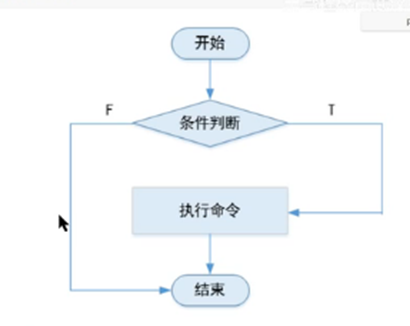
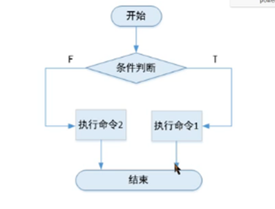

# Shell编程

## 一、基础

### 1.shell编程的课程目标

​	变量定义，

条件判断，循环语句，分支语句，函数和数组等。

​	基本正则式表达

​	文件处理工具的使用

### 2.什么是shell脚本？

​	简单来说就是将需要执行的命令保存到文本中，按照顺序执行，它是解释型的，意味着不需要编译。

​	描述：若干命令+脚本的基本格式+脚本特定语法+思想=shell脚本。

​	什么时候用到脚本：重复化复杂化的工作，通过把工作的命令写成脚本，以后仅仅需要执行脚本就能完成这些工作。

### 3.Shell脚本能干啥？

​	自动化软件部署 //Tomcat

​	自动化管理 //系统初始化、批量更改主机密钥等

​	自动化分析处理//统计网站访问量

​	自动化备份//数据库备份、日志转储

​	自动化监控脚本

### 4.脚本的基本写法

​	第一部分：#!/bin/bash或者#!/bin/env bash

​	第二部分：#注释说明

​	第三部分：具体代码

​	5.如何学好shell脚本？

## 二、   变量

​	\1.   创建变量的基本格式：变量名=值

​	\2.   变量命名规则：只能是英文字母与数字，不能以数字开头。

​	\3.   取消变量：unset 变量名

​	\4.   调用变量值:$变量名。

​	\5.   注意事项：等号两边不能直接接空格符；双引号里的特殊字符可以保持原有特性，单引号内的特殊字符仅为一般字符。

​	\6.   示例：大家在终端中敲如下命令：看看结果有什么区别。

​	Name=jack; 

​	2name= lili;

​	A=33,B=”$A”;C=’$A’

## 三、   交互式定义变量

语法：read [选项] [变量名]

选项：-p：定义提示用户的信息

   -n：定义字符长度

   -s：不显示输入内容

   -t：定义超时时间

大家在自己的终端输入以下命令

\1.   read –p “请输入你的姓名：” name

\2.   read –s –p “请输入你的密码：” pass

\3.   read –n 4 –p “输入你的电话号码：” number

## 四、   变量值来自一个文件（标准输入重定向）

例如：read –p “输入你的信息：” INF < 文件名

（注意：文件要已经存在） 

## 五、   定义有类型的变量（declare）

目的：给变量做一些限制，固定变量的类型

用法：declare 选项 变量名=变量值

-i:将变量看成整数

-r：定义只读变量

-a：定义普通数组，查看普通数组

-A：定义关联数组；查看关联数组

-x：将变量通过环境导出

## 六、   变量分类

本地变量；环境变量；全局变量；

## 七、   简单的四则运算

1.简单的四则运算表示方法

$(())、$[]、expr 、n=2、let n=n+2和let n=$n+2结果一样。

Shell中的计算不支持小数，只支持整数的相关运算。要想进行小数运算，要借助第三方工具bc。可以使用echo 1+1.5|bc。也可以敲bc进入程序，quit退出即可。

2.了解i++和++i。

对变量值没有什么影响。可在终端中敲以下命令：

i=1；let i++;echo $i

j=1; let ++j;echo $j

显示的结果都一样，说明对变量值没有什么影响，但是对于表达式的值来说，二者就有区别了。

例如：let x=i++//先赋值，再运算。

let y=++j//先运算，再赋值。

## 八、   条件判断语句

### 1.   条件判断语句语法格式

test 条件表达式

[空格符条件表达式空格]

[[空格条件表达式空格]] 支持正则

常见的是判断文件类型；判断文件新旧；判断字符串是否相等；判断权限等。

### 2.   条件判断相关参数

判断文件类型：

-e：判断文件是否存在（任何类型的文件都可以）

-f：判断文件是否存在并且是一个普通文件

-d：判断文件是否存在并且是一个目录

-L：判断文件是否存在并且是一个软链接文件

-b：判断文件是否存在并且是一个块设备文件

-s：判断文件是否存在并且是一个套接字文件

-c：判断文件是否存在并且是一个字符设备文件

-p：判断文件是否存在并且是一个命名管道文件。

-s：判断文件是否存在并且是一个非空文件（有内容）

示例：创建一个file1；echo hello > file2；mkdir dir1

test –e ./file1（判断当前目录下的file1是否存在）；echo $?(0为真，说明存在；1位假，不存在)

判断一个目录是否存在：[ -d ./dir1 ];echo $?

判断文件新旧：

判断文件权限：

-r：当前用户对其是否可读

-w：当前用户对其是否可写

-x：当前用户对其是否可执行

-u：是否有suid，高级权限冒险位

-g：是否有sgid，高级权限强制位

-k：是否有t位，高级权限粘滞位

test –r demo1.sh；echo $?

   判断整数

-eq 相等

-ne 不等

-gt 大于

-lt 小于

-ge 大于等于

-le 小于等于

判断字符串

-z 判断是否为空字符串，字符串长度为0则成立

-n 判断是否为非空字符串，字符串长度不为0则成立

string1 = string2 判断字符串是否相等

string1 != string2 判断字符串是否不相等。

示例：test –z “hello world”;echo $? 结果为1；

tset –n “hello world”;echo $? 结果为0。

test –n “空格”;echo $?结果为0，真说明非空，空格是字符。

test –n “”;echo $?结果显示为啥？

test –z “”;echo $?结果显示为啥？

test “hello” =”world”;echo $?结果为假

test “hello”! =”world”;echo $?结果为真

这里建议大家用双引号或者单引号将字符串引起来。

整数比较示例：

[1 –eq 2];echo $?结果为1

[1 –nq 2];echo $?结果为真

[1 –le 2];echo $?结果为真

多重条件判断

 

| 判断符号 | 含义   | 举例                                        |
| -------- | ------ | ------------------------------------------- |
| -a和&&   | 逻辑与 | [1 –eq 1 –a 1 –ne  0] [1 –eq 1]&&[1 –ne 0]  |
| -o和\|\| | 逻辑或 | [1 –eq 1 -0 1 –ne 1] [1 –eq 1]\|\|[1 –ne 0] |

与：两个条件同时满足才为真。

或：只要有一个条件满足就为真。

多个一起没有优先级。从左往右执行即可。

示例：

\1.   打印当前用户号可以敲 id ，然后回车；如果只想要数字可以敲：id –u这个命令可以打印用户id。

\2.   [ $(id -u) –eq 0] && echo “admin”

\3.   [ $(id -u) –eq 0] || echo “is not admin”

\4.   [ $(id -u) –eq 0] && echo “admin” || echo “is not admin”

\5.   [ 1 –eq 2 ] && echo AA || echo BB && echo CC。执行结果如何？

 

## 九、   流程控制语句

关键词：选择

基本语法结构：

### 1.   if结构

只要正确，就往下执行

F:表示False假

T：表示True，真

例如：书本p154的例子

也可以写成：

If [ condition ]; then

command

command 

fi

或者：

if test 条件；then

命令

fi

或者：

if [[ 条件 ]];then

命令

fi

或者：

[ 条件 ] && 命令

### 2.   if …..else

分叉路口二选一

If [ condition ];then

命令1

else

命令2

fi

或者：

[ 条件 ] && 命令1 || 命令2

示例：

命令行中：

if test 1 –eq 1;then echo hello;fi

脚本中写：

\#!/bin/bash

\#当给脚本传递的参数是hello的时候打印world；否则打印hello。

if [ “$1” = “hello”];then

echo world

 else

echo hello

fi

脚本中传递参数如何写：？echo “$1”

随堂练习：让用户自己输入字符串，如果用户输入的是hello，请打印world，否则打印hello。

循环命令书上比较完整，这里就不整理了。