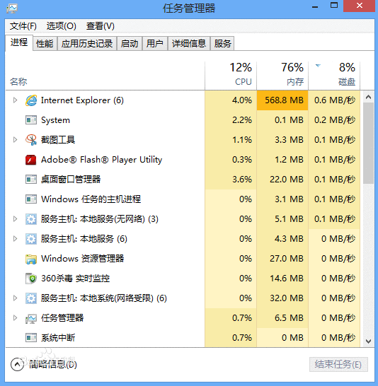

进程、线程和协程是三个在多任务处理中常听到的概念，三者各有区别又相互联系。

## 一、并行和并发

在介绍进程、线程和协程这三个概念之前，有两个操作系统中的相关概念需要简单解释一下：并行和并发。
**并行**：指多个任务同时执行。
**并发**：指在一个时间段内，多个程序都是在同一个处理机上运行，但任一个时刻点上只有一个程序在处理机上运行（即多个任务在同一处理机上交替执行）。

对单核CPU，因为一个CPU一次只能执行一条指令，是无法做到并行，只能做到并发。

## 二、进程

### 2.1 什么是进程

**进程（process）是一个程序在一个数据集中的一次动态执行过程**，可以简单理解为“**正在执行的程序**”，它是**系统进行资源分配和调度的基本单位**。我们日常使用电脑和手机打开的应用程序就属于进程 。


进程一般由程序、数据集、进程控制块三部分组成。我们编写的程序用来描述进程要完成哪些功能以及如何完成；数据集则是程序在执行过程中所需要使用的资源；进程控制块用来记录进程的外部特征，描述进程的执行变化过程，系统可以利用它来控制和管理进程，它是系统感知进程存在的唯一标志。

### 2.2 进程出现的原因

**进程的出现是为了更充分的利用CPU的资源使得能够并发执行任务**。假设有两个任务，一个是IO操作，一个是计算任务。如果一个任务接一个任务的执行，CPU在执行IO操作时需要等待数据读取完关闭文件后才能执行下一个计算任务，会使得CPU得不到充分的利用。如果在等待数据读取时让空闲的CPU切换到另一个任务去执行，等数据读取完后再切换回去就可以使CPU得到更充分的利用。要做到任务切换，需要能够识别任务以及保存和恢复任务的状态，而且不同的任务通常需要不同的系统资源，为此进程就被发明出来。系统正是通过进程分配资源、标识任务的。

### 2.3 进程的优缺点

优点：

- 相对比较稳定安全（进程拥有独立的系统资源，进程间不容易相互影响）

缺点：

- 进程切换的时空开销比较大（涉及到很多系统资源的切换）
- 进程间通信（[IPC](https://baike.baidu.com/item/进程间通信)）较为复杂和耗时

## 三、线程

### 3.1 什么是线程

线程(thread)是在进程之后发展出来的概念。**线程包含在进程中，也叫轻量级进程。线程是进程中一个单一顺序的控制流，像“线”一样（或许是其译名的由来），它是系统进行运算调度（即如何分配CPU去执行不同任务）的基本单位，一个进程的多个线程在执行不同任务的同时共享进程的系统资源（如虚拟地址空间，文件描述符等）**，如果把进程比作一个正在生产产品的车间，那么线程就好比是车间里面执行不同任务的工人，也可[把进程比作道路，而线程就好比是并行的车道](https://blog.csdn.net/daaikuaichuan/article/details/82951084)。线程由相关堆栈寄存器和线程控制块组成。


### 3.2 线程出现的原因

**线程的出现是为了减少任务切换的消耗，提高系统的并发性，实现让一个进程也能执行多个任务**。例如一个文本程序需要获取键盘输入、显示文本内容并将文本内容保存到磁盘。如果使用多个进程来执行这些任务，需要频繁的进行上下文切换和进程间通信。考虑到这些任务是相互关联且共享资源的（它们都要用到文本内容），用一个进程中的多个线程来执行可以减少上下文切换和进程间通信的消耗。

### 3.3 线程的优缺点

优点：

- 线程切换的开销比进程切换的开销小，减少了任务切换的消耗，提高了操作系统的并发性能。

缺点：

- 相比进程不够稳定，多线程在操作共享数据时容易出错（比如丢失数据、产生死锁）

## 四、协程

### 4.1 什么是协程

协程是一种**用户态的轻量级线程，又称"微线程"，英文名Coroutine，协程的调度完全由用户控制**。人们通常将协程和子程序（函数）比较着理解。
子程序调用总是一个入口，一次返回，一旦退出即完成了子程序的执行。
协程的起始处是第一个入口点，在协程里，返回点之后是接下来的入口点。

在python中，**协程可以通过yield来调用其它协程。通过yield方式转移执行权**的协程之间不是调用者与被调用者的关系，而是彼此对称、平等的，通过相互协作共同完成任务。其运行的大致流程如下：

```python
第一步，协程A开始执行。
第二步，协程A执行到一半，进入暂停，通过yield命令将执行权转移到协程B。
第三步，（一段时间后）协程B交还执行权。
第四步，协程A恢复执行。
1234
```

### 4.2 协程的特点

协程的特点在于是一个线程执行，与多线程相比，其优势体现在：

1. **协程的执行效率非常高**。因为子程序切换不是线程切换，而是由程序自身控制，因此，没有线程切换的开销，和多线程比，线程数量越多，协程的性能优势就越明显，在处理大规模并发连接（IO密集型任务）时，协程要优于线程。
2. **协程不需要多线程的锁机制**。在协程中控制共享资源不加锁，只需要判断状态就好了。

Tips:利用多核CPU最简单的方法是多进程+协程，既充分利用多核，又充分发挥协程的高效率，可获得极高的性能。

------

参考：
1.[进程、线程和协程的区别](http://www.cnblogs.com/guokaixin/p/6041237.html)
2.[协程-廖雪峰的官方网站](https://www.liaoxuefeng.com/wiki/001374738125095c955c1e6d8bb493182103fac9270762a000/0013868328689835ecd883d910145dfa8227b539725e5ed000)
3.[阮一峰的网络日志](http://www.ruanyifeng.com/blog/2015/04/generator.html)
\4. [进程，线程，协程与并行，并发](https://www.jianshu.com/p/f11724034d50)